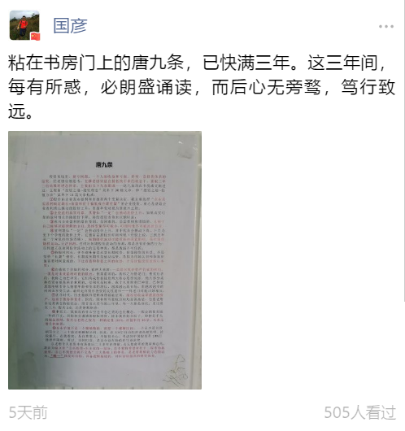

# 1500字，概括老唐投资体系的理念核心

> 来源: 唐书房

> 发布时间: 2020-10-13

> 原文链接: https://mp.weixin.qq.com/s/aashqGYsg7hyoLnVuz5Ujg

---

几天前，书房读者@国彦 发帖展示他摘抄并贴在书房门上的“唐九条”——这名儿听着官味十足，有点狐假虎威的赶脚

内容摘自老唐2017年11月的一篇文章[《**三年三倍的背后》**](http://mp.weixin.qq.com/s?__biz=MzI5NzA5MDEzNg==&mid=2649973988&idx=1&sn=ce1d06f53aef8a2919032213079f948f&chksm=f4bda9d3c3ca20c52225ad5e3f381be1cc3d2ca9fcf95581bb55de280218b1b068a12c147f3d&scene=21#wechat_redirect)。

三年后回看该文，发现当时写的挺完整的，这九条内容基本就是老唐整个投资体系的理念核心。

书房的其他理念类文章，只能算是变着花样，从不同角度、在不同市场状况下，对这九条内容的反复阐述。

今天单独将其摘出来重发一次，方便收录于书房底部菜单栏的“核心五篇”。

备注：由于公众号底部菜单栏只能放置五个子菜单，所以我选择将核心五篇里的[《**避雷要诀》**](http://mp.weixin.qq.com/s?__biz=MzI5NzA5MDEzNg==&mid=2649974266&idx=1&sn=d060f373031808bc8415918ed66b1cb9&chksm=f4bda8cdc3ca21dbe4c711aabda043226fb63733ea57683f59e2d19a504cfd4e004f7eb4f06c&scene=21#wechat_redirect)替换掉。

需要阅读[《**避雷要诀》**](http://mp.weixin.qq.com/s?__biz=MzI5NzA5MDEzNg==&mid=2649974266&idx=1&sn=d060f373031808bc8415918ed66b1cb9&chksm=f4bda8cdc3ca21dbe4c711aabda043226fb63733ea57683f59e2d19a504cfd4e004f7eb4f06c&scene=21#wechat_redirect)时，请向书房发送“避雷”提取。

谢谢@国彦 帮我勾起这篇文章

。之下为原文。

**

**投资市场里，盈亏同源，一个人的收益和亏损，是同一套投资体系的结果。**

**经老唐仔细思考，支撑老唐实盘在极低换手率的状态下，获取三年三倍结果的理念体系，主要由以下九条组成：**

**①股价由企业真实盈利和市盈率两个变量决定，我主要选择“企业真实盈利确定增长+市盈率位于偏低或合理位置”的企业投资。**

**重心是获取企业盈利增长推动的股价上升，市盈率变动视为算意外之财；**

**②企业盈利真实可靠，其增长“一定”会推动股价上升。**

**如果真实可靠的盈利增长伴随股价下降，将给投资者带来巨额财富；**

**③做出企业盈利的增长预测，是困难的，是需要极度谨慎的。**

**扎根于自己能够深度理解的企业，选择变量尽可能少，可预测性尽可能高的企业；**

**④盈利增长“一定”会推动股价上升，并不代表会推动下周、下月乃至下个季度的股价上升。**

**它通常需要较长时间体现，经验上说，三到五年是一个常见的体现周期。**

**短期股价波动可能受任何因素影响，是市场的随机运动，无法预测。**

**任何对短期股价波动的预测，都是没有价值的行为；**

**任何建立在短期股价波动上的交易体系，都是脆弱不可信的；**

**⑤持股时间长，并不意味着是从事长期投资。**

**价值投资的本质，不是坚持“长期”投资。**

**长期或短期只是被动结果，是因为市场认识和体现价值需要时间造成的。**

**下注市值和价值之间的收敛，才是价值投资的核心本质；**

**⑥市值低于价值的部分，有两大来源：一类是对现存资产价值的折扣，一类是对未来盈利可能的低估。**

**侧重前者的，我称之为格老门；侧重后者的，我称之为巴神堂，它们构成价值投资两大核心思想流派。**

**绝大部分成熟投资者都是两者兼顾的，差别只是权重。**

**我个人更侧重巴神堂，巴神堂思想能够引导人随着年龄和资本的增长，越来越远离市场，用越来越多的时间去享受生活，最终走向快乐投资的良性循环——格老门可能正好相反；**

**⑦法币时代，历史数据和逻辑推理都能证明，股权是收益率最高的资产，远高于债券和货币。**

**因而，除非所有股权目标均显著高估，否则老唐永远是满仓持股状态。**

**组合设立至今的三年里，每一天都是如此，无论股灾1.0，股灾2.0，还是熔断崩盘；**

**⑧事实上，我也没有什么空仓半仓之类的仓位概念，一般会预留家庭一年的开支，其他部分通通做股权投资，除非找不到目标了。**

**即便是手头的现金理财，我内心也将之视为一种确定性100%、市盈率约30倍、未来无增长的股票；**

**⑨企业价值不是一个精确数值，而是一个模糊区间，一个至少足以容纳百分之二三十波动的模糊区间。**

**因此，在30%空间内的所谓高抛低吸、波段操作，在我看来，是自欺欺人，不值得关心。**

**考虑到中国股市有10%日涨跌停限制，所以，日间盯盘，是完全没有价值的生命浪费。**

**三年的公开数据还不够长，而且老唐的运气似乎一贯不错，所以，三年三倍的成绩里面，究竟有多少是投资体系的功劳，有多少是运气的体现，可能还需要更长时间去观察。**

**此处只能借机说点个人思考和观察：**

**以老唐个人在资本市场前后二十多年的傻碰，及无数前辈的摸索和总结，我认为建立在“①买股票=买企业的一部分，②不要将希望寄托于二级市场接盘侠，③占不到便宜就不交易”三大基础上的体系，**

**是老唐理解能力范围以内，“唯一”稳妥可信的、具备逻辑基础的、可以持续盈利的投资体系。**

**这条路已经有无数前辈走通过，踏平过。路边留下了无数的方向标、指示牌、陷阱提醒。**

**如果你的目标是财富增长，老唐强烈建议不要浪费生命探索和碰壁，不要试图重新发明车轮，只需要老老实实地沿着前辈们踩出来的路前行即可。**

**要创新，要建立新体系，可以留待身家突破10位数以后考虑。**

---

*本文抓取时间: 2026-04-12 16:19:43*
