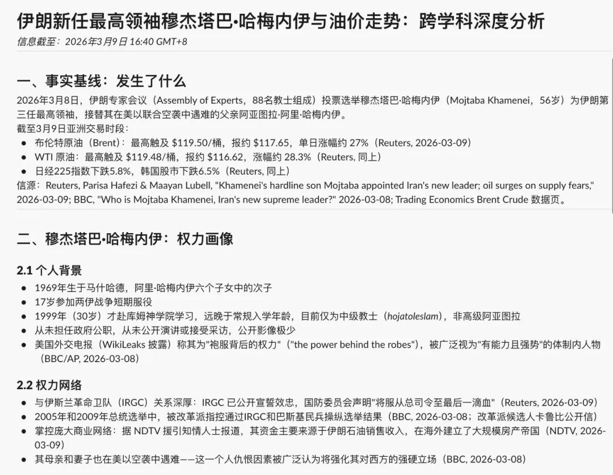
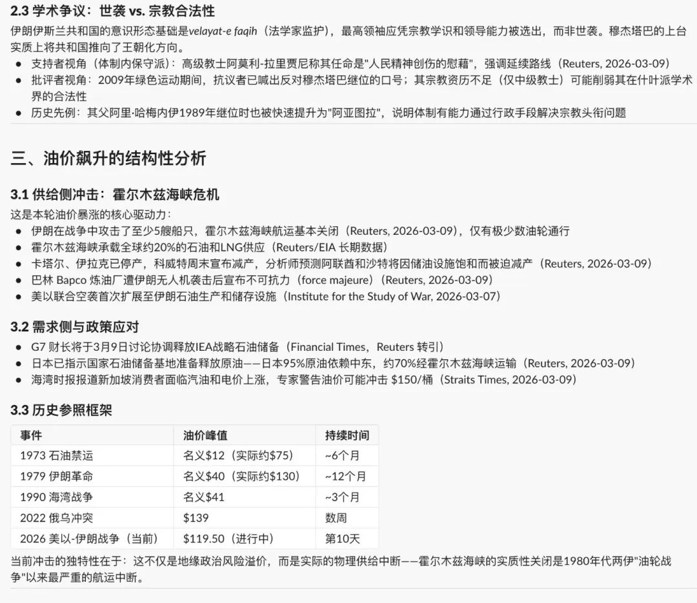
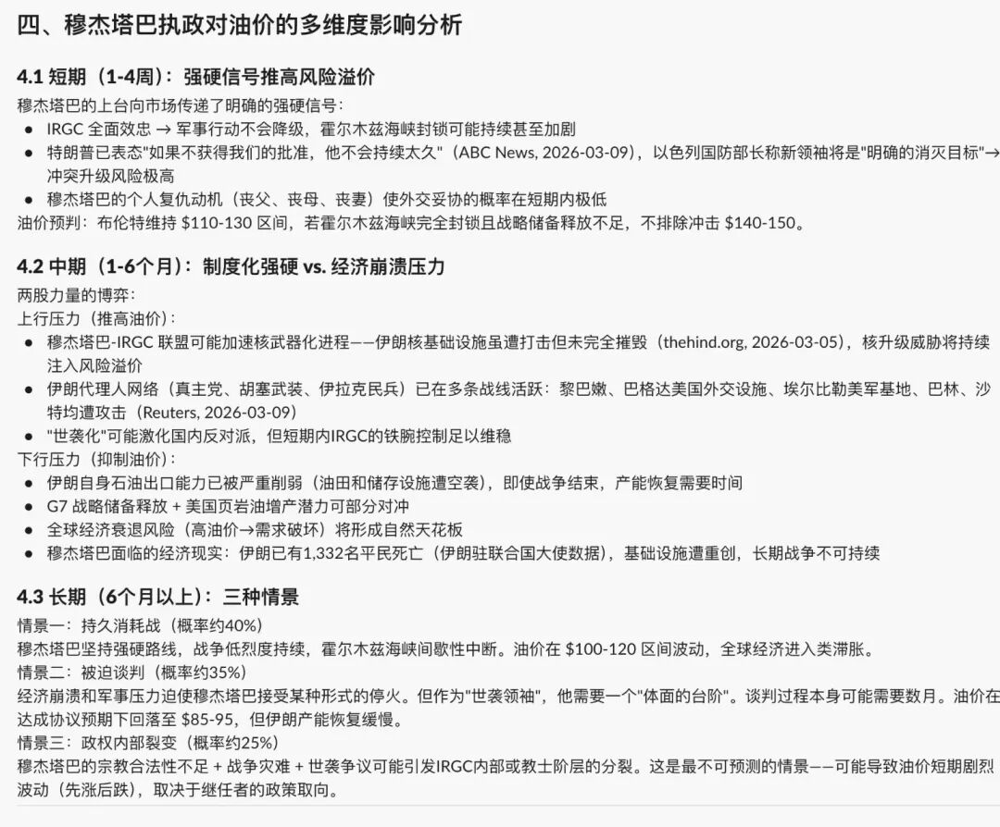
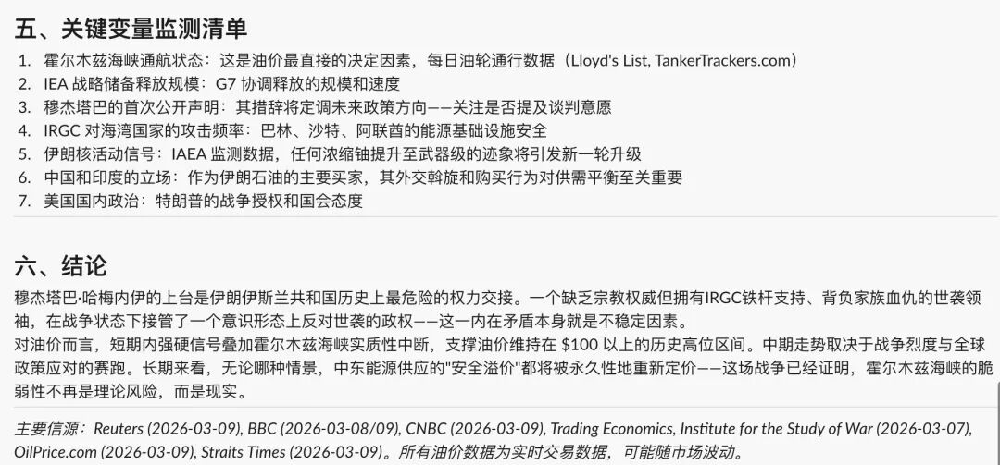

# Claude Opus 4.6的强悍实力

> 来源: 太阳照常升起

> 发布时间: 2026-03-09

> 原文链接: https://mp.weixin.qq.com/s/oCWHEjV74MbW0ZJ1xmYa0g

---

一位技术专家朋友将作者此前的Memory skill（《[如何发挥AI的最大效能](https://mp.weixin.qq.com/s?__biz=MzI0ODE5NDU5Mw==&mid=2649551572&idx=1&sn=3ffe3c6307ef9219fdc80a87c7d3ea43&scene=21#wechat_redirect)》）套用到了Claude Opus 4.6上，展现了以下实力：

需要注意的是，**这并非一个深度研究，而只是输入了一句话，就瞬时通过Claude得到的反馈**。这充分说明，作者此前关于**“信源权威和信息时效双优先+多声部讨论+交叉验证”**的memory skill，在当前的最强AI模型上能够获得更极致的表现。

所以，如何发挥出AI模型的最大潜能，是高度依赖于使用者的逻辑、框架及语言能力的。

这个实例也让我们看到，国产模型的能力，与最强的美国模型之间，仍有较大差距。国产大模型企业，还是应该老老实实做好底座能力，而不是每天搞花里胡哨的claw装机，骗外行。

在AI发展的路径上，投机取巧是没有未来的。

以上。

---

*本文抓取时间: 2026-04-13 06:57:24*
