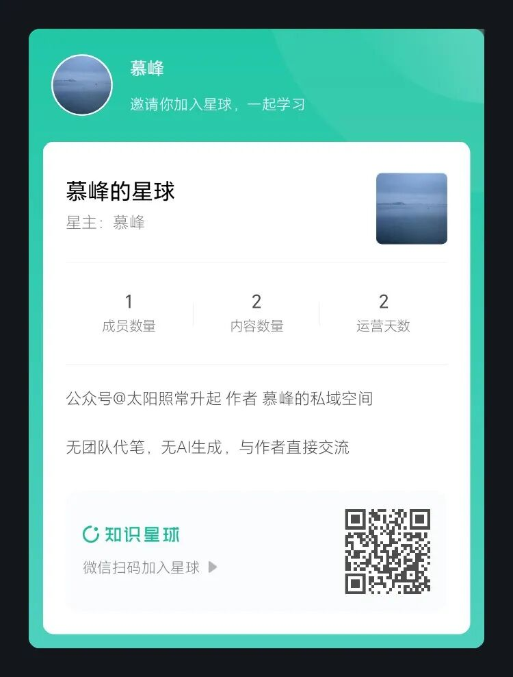
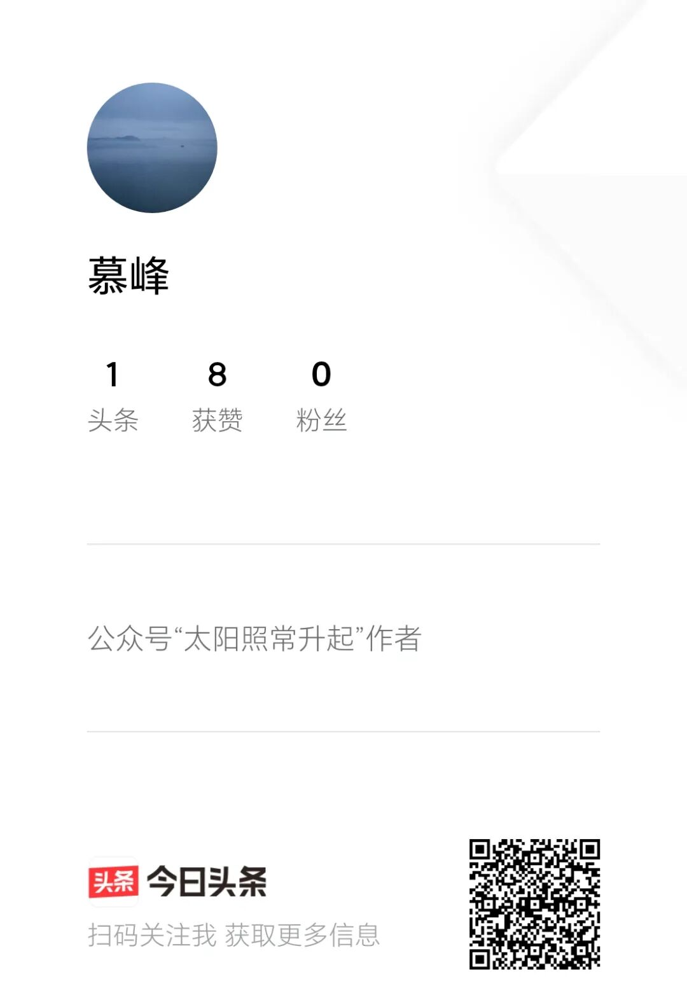

# 入驻今日头条和知识星球的声明

> 来源: 太阳照常升起

> 发布时间: 2026-03-29

> 原文链接: https://mp.weixin.qq.com/s/T4NVGhpfUN0DaYpr8TurSg

---

**希望长期读者能够耐心阅读完本文**。

作者此前做了一个调研《[拟入驻其他社交媒体平台的声明](https://mp.weixin.qq.com/s?__biz=MzI0ODE5NDU5Mw==&mid=2649551684&idx=1&sn=8a4741e704b484176590ce07dd6d5529&scene=21#wechat_redirect)》

根据大家的反馈，B站、知识星球、头条、小红书、抖音等，是读者们日常使用较多的app。

B站有图文部门的负责人在持续沟通，由于作者暂时没有时间做视频化，所以图文方面合作，还需要彼此再打磨一下。

字节系同学的沟通是全方位的，头条、抖音甚至tiktok（美国）都有专人沟通，字节总裁办的长期读者朋友也非常支持。

知识星球是不少读者呼声较高的选择。知识星球其实没有主动沟通作者，作者直接从知识星球app随意联系了一位客服人员，当即表示也是读者，然后提供了很细致清晰的解释。

小红书的定位与作者写作内容似乎不太匹配，且还没有专人沟通过，因此暂不考虑。

还有不少海外读者推荐境外的平台，感谢跨时区的信任，但操作上确实太繁琐，且作者不会因为是境外平台就讲不一样的话，因此海外读者不会有任何阅读损失，这些就暂时都不考虑了。

**接下来作者认真说一下整体安排及相关考虑**。

这几天得到的读者回应，无论是留言还是私信，都非常令人感动。大多数读者其实日常都不会留言或者私信，只是默默关注。这几天不少长期读者都是第一次给作者留言，读完后更让作者认为，这是一个作者与读者长期共同形成的思考与交流空间。一位中年读者写来很长留言，表示平日繁忙，周末带孩子上辅导班，只有在有时间休息时，才会打开翻看还没来得及看的文章。诸如此类的未公开留言和私信还有很多。

作者并无任何预见能力，也不是方方面面的“专家”，过往多年对不同事件的看法，之所以能有许多“应验”，不是因为有任何“内幕信息”或者“建言权力”，而是一直作为一个活人在认真思考，换位体悟，充分表达。这就是当前这个AI时代越来越欠缺的——**活人感**。

语言并不只是内容的载体，甚至也不只是思想本身，它是人之为人而区别于万物的根本，是人类作为碳基生物以短暂生命去博得身后存续的努力证明。人类与AI的最大区别，就是人类自其出生起，就要直面和对抗死亡这个必然的结局。

信息流的传播模式，非常大程度上在消灭活人感，作者与读者再难相见，彼此沟通的联结逐渐丧失。犹如一家人，本可每日相见，互诉衷肠，却被人为天各一方，只能偶尔联系。

作者一直不愿跨平台写作，因为仅是利用业余时间，且非常在意与读者沟通的顺畅。但当前公众号的信息流模式，已让读者与作者彼此分离，就此而言，多平台发表只能是顺势而为。

作者这两日认真思考了未来多平台发表的状态，基本安排是：

**1、每篇文章仍然都会在不同平台发表，原则上都会在同一天发表，具体时间有先后，但不影响读者在不同平台阅读。除非，某一平台禁止发表某篇文章。对于单个平台删除的文章，作者不会尝试在该平台再次发表，除非有客服人员沟通调整**。

**2、本公众号仍然是主要发表平台之一，方便大多数老读者不改变阅读习惯**。鉴于当前每篇文章的打开率极低（低于85%），各位读者可采取星标等方式自行调整，以获得更高的阅读可能性。作者会不定期发布公众号文章的打开率。

**3、今日头条已注册（头条号：慕峰），将是文章发表的主要平台之一**。日常使用今日头条app的读者可以关注。头条号也是信息流动模式，且作为一个分发平台，作者的互动可能会较少，视未来读者情况而定。

**4、知识星球已注册（星球号：慕峰的星球），将是文章发表的主要平台之一**。知识星球是一个收费平台，因此必须多讲几句。愿意通过年费方式获得更干净阅读和讨论空间的读者占相当的比例，主要包括金融行业、互联网行业、半导体行业、其他外贸行业等产业界读者。由于作者不少文章涉及到相关产业，因此这部分读者希望获得一个比较干净、纯粹和专业的互动空间。此外，一些从事个人投资的读者，也有类似诉求。在当前公众号状态下，同一篇文章不同读者群体的视角其实是完全不同的。例如，对当前美伊战争趋势的判断，有部分读者是时政爱好者，留言是比较随意的；但有部分其实是投资者或金融从业人员，或者希望更多理性探讨的读者，需要相对深入理性的讨论空间。 这部分读者的诉求，理应得到回应。

作者也需要强调，过往一些公众号大V迁往知识星球后，都进行了团队化和商业化，许多内容不再是作者自己来写作，而是团队产出，包括各种看似“及时”的分析或数据资料汇总，如今很可能都是AI生产。作者不可能选择这种商业化模式，也不会以大量无意义的“分析”、“资料”来显得“物有所值”。

一直以来，作者在公众号上许多免费的文章，其经济价值远远大于许多收费的分析，这并非因为单篇文章有多重要，而是在与不同领域读者互动的过程中，作者不断吸收新的信息和资料再加深思考并持续输出。**这种“连续剧”的价值，是当前绝大多数追求热点的网红写作者都难以复制的**。长期读者都能感受到，作者十年前的思考在今天仍然适用，并且可以通过历史文章见证整个过程。

因此，**作者入驻知识星球，并不会提供额外无意义的所谓“资料”、“分析”**。这些东西，读者花百十来元买个AI会员，再通过作者已免费开源的AI Memory Skill就可以得到，何必当韭菜？那除了在其他平台都能看到的文章，**在知识星球各位读者还能获得什么呢**？

**一是相对封闭且有时序的阅读环境，不再受信息流所困**。

**二是相对封闭且专业的讨论空间，不再受情绪化信息所困**。

**三是向作者提问沟通的机会**。但作者不承诺每个问题都能及时回复，因为时间有限。如果是类型化问题，可能会统一回复；如果是值得回复且作者思考比较清晰的问题，作者会单独回复；如果是作者不了解，会直接回复不了解，不会假装懂。

**四是高质量读者之间交流的机会**。作者非常愿意通过这个新的平台来发掘优秀的读者参与更多的互动。作者的读者群质量是少有的高，有许多读者都是各领域的翘楚，如果能通过这个平台让他们来展示自己的认知，相信是一件非常非常有意义的事。在未来适当时候，作者也希望以播客对话的方式，与高质量的读者一起与大家进行分享。

关于星球的收费，作者征求了一些行业读者的意见，金融行业部分读者建议设置高一些（例如499元/年），以限定更针对性的人群。考虑到历史上作者的分析对这部分读者投资收益的帮助，这个收费确实不算高。但对于非投资群体而言，作者认为还是有些高了，有更多视角的读者参与，其实有利于形成更好的认知。**作者查看了星球中不同的收费情况，决定初期将年费设置在199元**。这个年费其实比许多“高产低质”的星球主都要低很多，更比许多卖资料、卖课的星球主要低很多很多，要知道这些资料和课程其实绝大多数今天都可以是AI生成的，毫无意义。

**作者还需要进一步言明：**

1、作者长期以来都是利用业余时间写作，与日常工作毫无关系，且自始至终都会与所在行业、单位和职业相隔离，以避免不必要的合规性问题。因此，**对于知识星球这类收费平台而言，请与作者有日常工作往来的个体，切勿加入**。

2、作者了解自己的许多文章都受到投资者或金融从业者的关注，但在任何平台都仅会论及产业、行业或宏观经济，**作者不会就具体投资事宜发表任何观点**。因此无论在哪个平台，**所有读者均不应公开讨论具体的投资事宜，尤其不能出现任何具体投资产品的推荐**。

**3、作者将一如既往地与内容商业化保持距离**。作者的文章不会出现任何隐藏式软广，作者在论及具体的企业时，确保不持有该企业或该企业竞争对手的任何证券或证券衍生产品。作者同样要求，所有读者不应在讨论时出现任何隐性广告或对具体企业的引导性评论。

**4、除用于展示AI能力并明确说明是AI生成外，作者所有的文字都将是自己独立完成**。没有任何团队代笔，也不会是AI自动生成。AI当前对作者而言，是一个高效的信息验真和信息获取工具，最终的判断，仍是由作者自己做出。

**5、尽管部分平台有年费收取，但作者并不承诺会额外提供所谓“更内幕”的观点或信息，但基于一个相对纯粹和高质量的讨论环境而言，在问答中随时形成一些有意义的观点，也是一定的**。这些内容，没有时间，也没有理由分享到收费平台外部。总体而言，如果读者对收费平台有一个比较低的预期，很可能就会有一个比较高的获得感。

**6、对于仍然只使用公众号的读者，请不要有任何失落感**。因为作者已经承诺，所有原创文章仍然会出现在所有平台。公众号的读者，仍然是作者重点关心的。也不排除，部分文章（例如涉及对公众号看法的文章），会只出现在这里。

以上就是作者截至目前的基本考虑和交代。再次感谢各位读者长期以来的关注。**这将是新的开始，也会是旧的延续**。

（**近期可能会有不少读者加入新平台，难免可能出现一些小问题，请勿着急，作者会逐一处理）**

以上。

---

*本文抓取时间: 2026-04-12 16:19:45*
