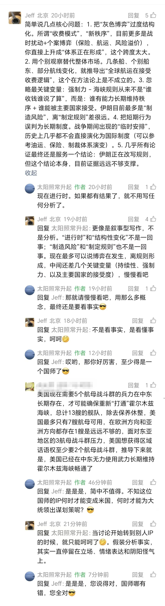

# 当杠精有了文化

> 来源: 太阳照常升起

> 发布时间: 2026-04-07

> 原文链接: https://mp.weixin.qq.com/s/xb4CwTCD2pZUFR4onwhfNg

---

昨天写了一篇《[霍尔木兹海峡谈判的明线与暗线](https://mp.weixin.qq.com/s?__biz=MzI0ODE5NDU5Mw==&mid=2649551772&idx=1&sn=2232bea76d97ab4b6824d3b9f31988e2&scene=21#wechat_redirect)》，一位3月27日才关注公号的读者，进行了“很专业”的留言，一开始作者也没觉得讲得有什么不对，有不同意见嘛，都很正常，就正常回了一句。但这位读者不干了，要体现自己是很专业，自己很能“看懂事实”。

上面“简中不值得”那句，是回应读者留言讽刺简中网的，但读者那句留言已经被后台删了，还没来得及截屏。这也是作者不满的一点，任何一个读者都可以在后台随便讲，如果后台有AI能力，直接不显示就行了，显示出来又删掉，何必呢？搞得作者的留言跟一个坏人一样。虽然作者平时对简中信息也有颇多微词，但很显然，这位读者是想体现自己高人一等。这就没必要再认真回应了。

有很多杠精，确实水平不够，语言粗糙。但有的不是。这类能用很多词汇的杠精，来这里找感觉的确实也不少。

这是面对大众的公众号，作者在美伊战争的进展上，以日更的方式，去记录作者的思考，你同意或者不同意，都不要紧。但来这里装B就没意思了，对吧。作者写特别专业的文章，怎么没见你留言呢？是没有能力评价，是怕自己说错，还是只能就这一个话题留言呢？

此前还遇到另一位，曾经加过作者微信的读者，以前是一位记者，还有点小名气。作者之前写《[慕峰：提高农民养老金的迫切性和现实路径](https://mp.weixin.qq.com/s?__biz=MzI0ODE5NDU5Mw==&mid=2649551580&idx=1&sn=7d4e5e4b4b2335b37ae6535b098e3b00&scene=21#wechat_redirect)》这个话题，很多读者可能无法想象，有不少“文化人”，强烈反对给农民提高养老金，哪怕多提高100元他们也反对。

这位记者当时看到这篇文章后，在朋友圈阴阳，作者以为有什么合理的理由，就在朋友圈留言讲，今年不少人大代表、政协委员终于都提到这件事了，是好事，应该多呼吁。

人家不干了，留言回复，他觉得这样直接增加养老金就是不对的。因为上海的农村老年人，养老金都超过2,000元了，现在还提什么加到500元，都是沽名钓誉。

作者讲，那这个国家有几个上海呢？

然后又一通输出，各种阴阳。

考虑到彼此还认识，作者也没撕破，最后实在说不下去，这位读者就把作者拉黑了。这条朋友圈，也看不到了，还好截了屏。不过当时还是觉得很诧异，因为这位记者曾经把上海农村改革写了一本书。哪知道，是只关心上海呢？

当然也不要地图炮，别的地方的人，也会反对这件事。比如以前留言里还有一位贵州的读者，也是强烈反对给农民增加养老金。这些赞成与反对，跟在哪里其实无关。当然肯定有一点，农村人不可能反对。

这都是有文化的读者。因为他们会计算，会表达，会用各种概念，会用各种理论来评价你的文章和观点。

然而，能改变他们是杠精的事实吗？不能。

一个杠精，念了再多书，也是杠精。

他无法接受别人拥有不同的观点，无法接受人与人之间的真诚关心。在他们眼里，他脑子里仅有的那点知识、概念才是最重要的。为了那一点可怜的知识、概念，他宁可选择失去理智、失去良知。

就像前两天疯狂留言的一些杠精，在他们眼里，无论采取什么手段，哪怕伊朗老百姓被屠戮，只要能把伊朗改朝换代，就是正义的。真的懂正义吗？还是内塔尼亚胡和川普的奴仆呢？

从前两天开始，作者对待杠精的态度就是，欢迎欢迎热烈欢迎，欢迎来多增加点击量，你说得对，你说得都对，你就是懂王本王

以上。

**如果不想看到杠精，可加入作者的知识星球**！

---

*本文抓取时间: 2026-04-12 16:19:43*
