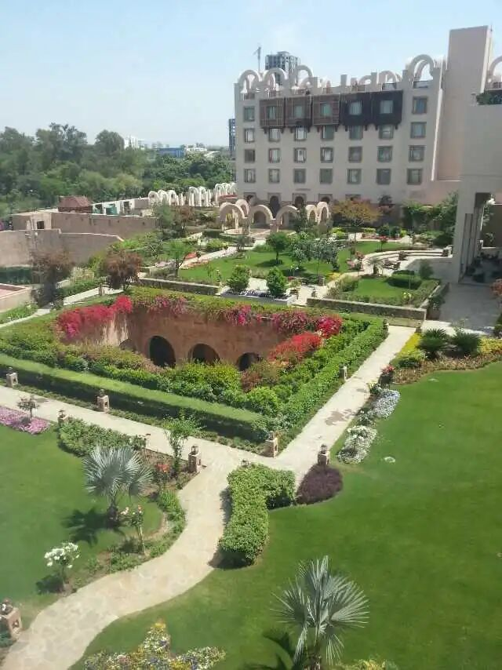
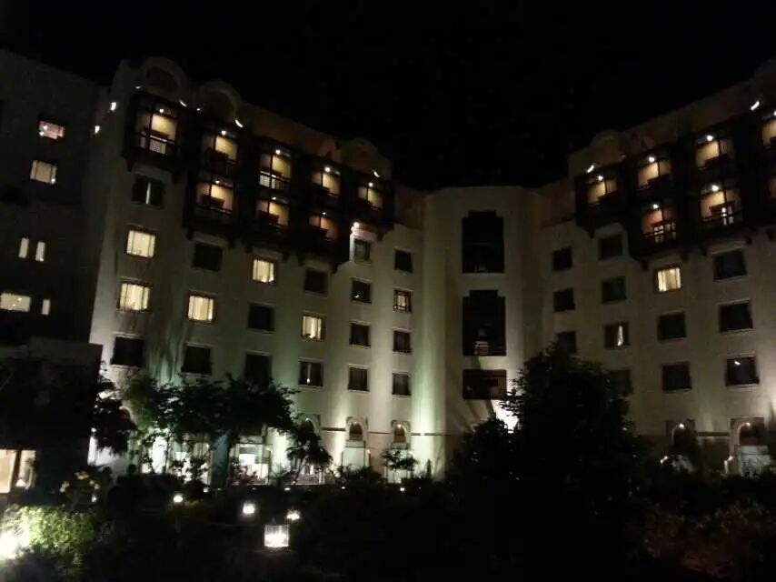
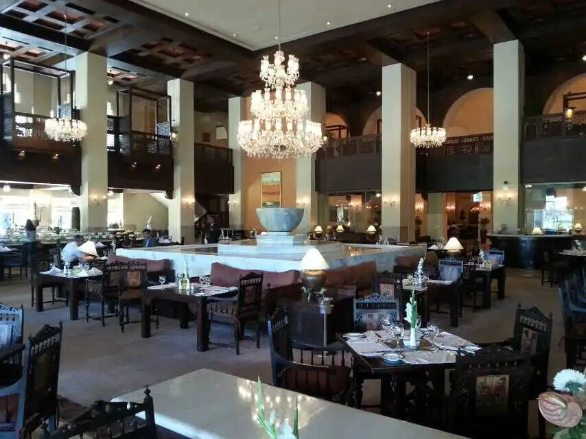

# 美伊谈判代表及谈判地点细节

> 来源: 太阳照常升起

> 发布时间: 2026-04-11

> 原文链接: https://mp.weixin.qq.com/s/Le6TUnS5xqwfmiXoiVRG9A

---

**谈判代表和地点的细节其实很有意思**。

**一、谈判代表**

**1、美国方面**

已披露的谈判代表是副总统**万斯**，以及川普的女婿**库什纳**和川普的房地产商好友**维特科夫**。万斯代表的是停战势力，也是伊朗此前指定可以对话的人物。库什纳和维特科夫此前是被伊朗排斥的谈判人选，尤其库什纳是以色列代言人，代表继续开战的倾向。

目前媒体暂未披露美国其他的参会人员。

美国由副总统领队，伊朗则是议会议长领队，看起来并不对等。但考虑到美国副总统也是参议院议长，也算勉强对等吧。

**2、伊朗方面**

英文和中文的报道都非常简略，其实伊朗Fars News以及伊朗学生通讯社（ISNA）的波斯文新闻披露了伊朗谈判代表团构成，由安全、政治、军事、经济和法律委员会组成。ISNA披露伊朗技术团队成员26人，其外还有媒体和支持团队，总计70-80人。

已披露的主要谈判成员包括：

（**1）领队**

**伊朗议会议长，卡利巴夫（**Mohammad Bagher Qalibaf）

卡利巴夫是伊朗革命卫队（IRGC）出身，担任过IRGC的经济核心Khatam al-Anbia建设总部的总经理，IRGC空军司令和德黑兰市长，是老哈梅内伊非常信任的人，与苏莱曼尼关系密切。负责人国际事务的**议长特别助理阿莫伊（**Aboulfazl Amouei**），以及**议会国家安全与外交政策委员会副主席纳布维安（**Mahmoud Nabavian**）也参会。

（**2）外交团队**

**外交部长，阿拉格奇（Abbs Araghchi）**

伊朗外交领域的灵魂人物，早年志愿加入过IRGC，参加过两伊战争，英国肯特大学博士，1989年起一直在伊朗外交系统工作，是《伊核协议》的关键架构师。

**外交部副部长，阿巴迪（Kazem Gharib Abadi**）**

前伊朗常驻国际原子能机构代表，目前为首席核谈判代表。

（**3）国安团队**

**国防委员会秘书，艾哈万迪安（Ali Akbar Ahmadian）**

1980年代攻读德黑兰大学牙医学博士，期间两伊战争爆发，中断学业加入IRGC，后担任过IRGC海军司令、联合参谋部总司令，以及IRGC战略研究中心负责人（负责制定IRGC安全、军事政策及导弹计划）。2026年3月15日被小哈梅内伊任命为国防委员会秘书。

**最高国家安全委员会国际事务副秘书，卡尼（Ali Bagheri Kani**）**

卡尼早年就在伊朗最高国家安全委员会任职，后历经司法部、外交部，再回到国安委。2015年对《伊核协议》持批评态度，对美国极不信任，是强硬派代表。

（**4）经济团队**

**伊朗央行行长，赫马蒂（Abdlonasser Hemmati）**

德黑兰大学经济学院教授，伊朗“私营保险之父”，曾担任伊朗驻中国大使和经济部长。

**财政治理研究员沙克里（Majid Shakeri）**

Fars News对沙克里的介绍是，“他的核心能力在于剖析复杂的货币结构，并设计国际贸易替代模型。**他精通制裁机制和全球支付网络**，在提出减少国家金融脆弱性的操作性解决方案方面发挥着有效作用。他将货币经济学理论与外汇市场执行现实相联系的专业知识，使他成为管理外汇储备战略咨询的关键人选。”

**议会研究中心经济研究办公室副主任，塔巴（Seyed Mehdi Bani Tabba）**。

Fars News对塔巴的介绍是，**“他专注于经济结构维度和财政政策。他的突出能力在于分析法律法规对宏观经济变量的影响。他的专注领域包括经济政策制定、结构性改革以及评估经济法规的影响。”**

**二、谈判地点**

各方媒体披露此次谈判地点是巴基斯坦首都伊斯兰堡的**Serena酒店**。这是伊斯兰堡为数不多的五星级酒店之一，经常承担巴基斯坦外交、国事和国际会议的任务。这座酒店的大门在一个陡坡上，日常路障颇多，安全性比另一家五星级酒店万豪要高。作者过去出差时，曾两次入住这家酒店。Serena酒店连锁是什叶派伊斯玛仪派第49代伊玛目阿迦汗四世创办的阿迦汗发展网络（AKDN）的下属产业，有浓郁的伊斯兰风格，与欧美系国际酒店有很大不同。以下是当前入住时拍摄的照片：

餐食还挺有特色的，就是不知道双方团队有没有心情品尝了。

此外，昨天中文网络传言有以色列代表参会，作者至今没有看到任何媒体有这样的报道。以色列与伊朗未建交，且以色列一直反对美国与伊朗直接谈判。此次以色列本就想搅黄谈判，如果美国允许以色列代表出现在现场，不如不谈。

以上。

**更多深入讨论，可加入作者的知识星球**！

---

*本文抓取时间: 2026-04-12 16:19:43*
