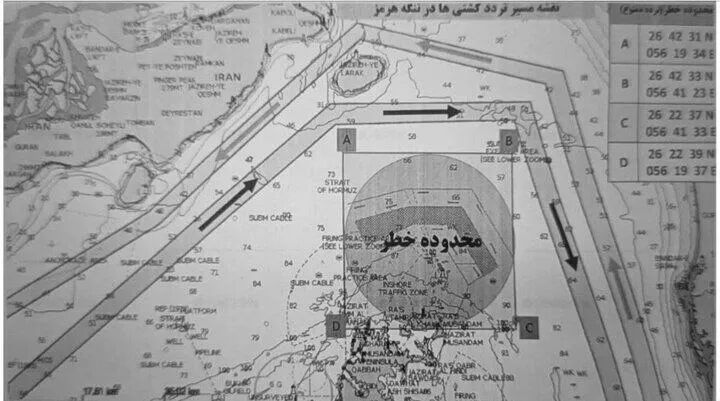

# 由俭入奢易，由奢入俭难

> 来源: 太阳照常升起

> 发布时间: 2026-04-13

> 原文链接: https://mp.weixin.qq.com/s/NgNWBPaHD0ezQxVmwY6vWg

---

川普“以封锁对封锁”的策略开始实施了。其中的漏洞有几个：

**1、当前所有商船只要想驶出霍尔木兹海峡，都要过伊朗的港口（如图）**

这一安全航道内有拉拉克岛码头和格什姆岛码头，然后行进50公里，就到达伊朗最重要的港口，阿巴斯港了。

也就是，按照目前伊朗划定的安全路线，所有从波斯湾驶出霍尔木兹海峡的船只，都会过阿巴斯港。但按照川普的规矩，“从伊朗港口驶出”的船只，都是不准驶出海峡的，哪怕是美国盟国的商船。所以，该怎么执行呢？

川普和他的谋士可能看不懂地图，或者根本就没有看过地图，这是中国大陆初中一年级地理课教的内容。

**2、在海峡外围的登临检查成本很高**

昨天《[川普能以“封锁海峡”促“开放”吗？](https://mp.weixin.qq.com/s?__biz=MzI0ODE5NDU5Mw==&mid=2649551824&idx=1&sn=5f9035cc55f1e00444b26664686eab15&scene=21#wechat_redirect)》已经讲过了，不赘述。除检查成本高之外，美国军舰还不能太靠近伊朗的港口、码头，如果敢靠近，早冲进去了，不用等到今天。

**3、双重封锁只能让商船更不敢行动**

伊朗披露谈判时美国团队果然提出了要“共享”海峡收费的诉求，美国也没有否认，那就是真的了。这就是川普的商人思维，他脑子里根本没有法治、国际法这些东西，首先想到的是钱。那些认为美国伟光正不可能接受海峡收费安排的大聪明，又遭到了一万点爆击。不是不想收，而是伊朗不让川普收，这下明白了？

问题是双重封锁下，商船还敢动吗？油气和化肥原料还能运出吗？

这就痛苦了，十分痛苦。

**痛苦的不是资源丰富的国家，也不是早有准备的国家，而是那些资源储备脆弱的国家，其中不少是美国的盟友**。影响也很大，之前就分析过了，除了石油天然气，还有石化产品，对化肥、半导体制造都有巨大影响。

就看谁先撑不住了。

伊朗会先撑不住吗？大聪明认为，美国一封海峡，伊朗就没法进口物资了，就要崩溃了。为什么说九年制义务教育很重要呢？因为初中一年级地理课就会告诉你，**伊朗根本就不是一个岛国**，你怎么可能仅通过海禁就封锁住它呢？

**伊朗陆路，东部连接土库曼斯坦、巴基斯坦，西部连接伊拉克、土耳其，北部通过里海直连俄罗斯和哈萨克斯坦**。这些都是伊朗一直以来的进出口贸易国，伊朗的大量物资，包括粮食、医药、工业品，都是通过这些通道进入的。请问，美国怎么封？要对上述国家一一开战吗？难道先把北约盟友土耳其干掉？土耳其最近可是对以色列非常不满的，要不考虑一下？

大聪明们，你们在网上替美国以色列打仗都不看地图的吗？你们的手机连百度地图、高德地图都装不上吗？现在两百元的手机都能装的呀，难道你们连最便宜的安卓机都买不起？

所以谁会先撑不住呢？

伊朗长年被经济制裁，老百姓日子虽然过得苦，但已经习惯了有口饭就能活的状态。不信你去社交媒体平台看看那些在伊朗本土，尤其是农村地区这几天的生活，吃饭是没问题了，不仅如此，你还会知道，随着伊朗控制海峡，里亚尔还升值了，没想到吧？

但那些生活在蜜水里的上国，能有这样的心态吗？

**4、如果海峡内的船只越来越少，那今后影子舰队怎么办**？

这是一个好问题。如果伊朗不断放开海峡内船只驶出的规模，那美国在海峡外围不计成本的封控，可能会让今后驶入海峡的影子舰队数量减少，从而影响伊朗的收入。

那怎么办呢？

这不很简单吗？由于美国剥夺了伊朗的收入能力，那今后就提高通行费呗，同比提高。如果美国解除封锁，就降下来；如果美国解除制裁，就再降。把通行费跟美国的行为挂钩，童叟无欺，指向明确，道德感优越。

这很难吗？

所以究竟是谁在维持高油价呢？谁在制造全球油气资源稀缺呢？

可能再过不到一个月，很多国家就得公开表态，不如接受那1美元/桶的通行费了，因为，这才是成本最低的解决方式。

接下来，请杠精们继续你们的表演，留言位已经准备好了！

以上。

**正常人的讨论，欢迎加入作者的知识星球**！

---

*本文抓取时间: 2026-04-13 18:09:19*
