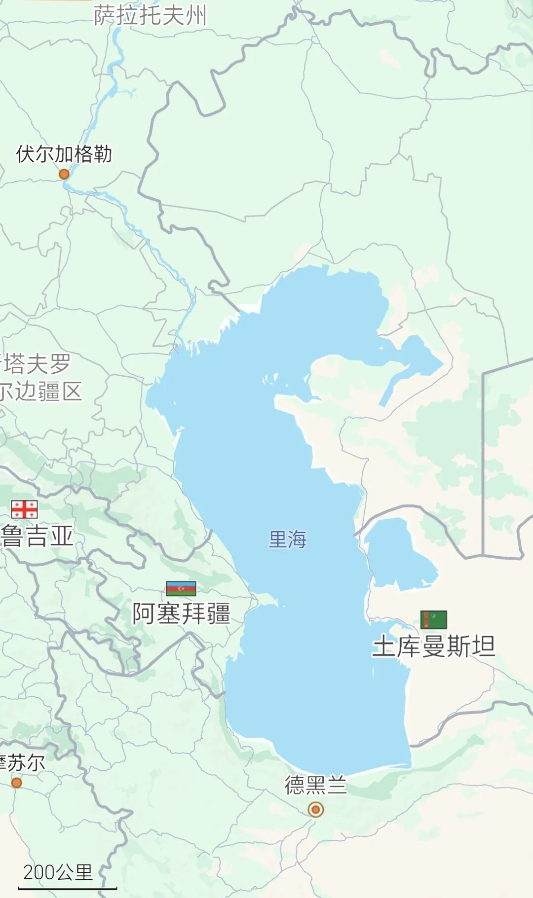

# 伊朗的进口替代方案启动了

> 来源: 太阳照常升起

> 发布时间: 2026-04-15

> 原文链接: https://mp.weixin.qq.com/s/gCDOECVe954y77WT_jzBQA

---

《[由俭入奢易，由奢入俭难](https://mp.weixin.qq.com/s?__biz=MzI0ODE5NDU5Mw==&mid=2649551828&idx=1&sn=d1a1f073f0234b7800334ff46e642a3d&scene=21#wechat_redirect)》中已经讲过了，伊朗不是一个岛国，它北面的里海出海口和东西的陆路走廊一直是畅通的，也是其重要的进出口通道。

大聪明们查AI，讲伊朗进出口90%靠南部海运，所以把霍尔木兹海峡出口一封，东西北部出口通道根本无法替代。于是纷纷表示，川普大统领威武，这下伊朗只能投降了。

知道希拉里·克林顿怎么评价的吗？希拉里讲，她对川普说“未被告知伊朗可能关闭霍尔木兹海峡表示震惊”。这就是作者讲的，川普及其郭图、蒋干团队，从来不去看历任美国高官都会看的军事智库报告。所以，你认为川普突发奇想的封控海峡会有奇效吗？

要不怎么说是大聪明呢？针锋相对时期，伊朗需要的是进出口全面替代吗？**伊朗需要的甚至都不是出口，而是一定时间内必需品的进口**。

**美伊互封海峡拼的就是谁的低水平生存能力更强**。

**对伊朗而言，它的生存期限就是可以获得必需物资的时间能有多长，取决于外部给它的输入意愿和能力，以及它自己的购买能力**。

这个能力，在开战前，伊朗应该就测算过，各相关国最迟在3月下旬，也都测算过了。为什么是3月下旬呢，因为连作者都在3月底都考虑到这个问题了。

这里最关键的支持者其实是俄罗斯，因为伊朗北部里海口岸是直通俄罗斯的。除了粮食外，最重要的必需品物资其实是医药用品。

各位请看地图：

俄罗斯伏尔加格勒到德黑兰的便利程度其实比走霍尔木兹海峡还要高。

且不说，东北边陆路直通土库曼斯坦，西北边陆路直通土耳其。

伊朗迈赫尔通讯社（Mehr News Agency）今天报道：“伊朗经济部已做出专项决策并得到部长的特别指示，向全国各地的自由贸易区赋予了新使命——成为**基本物资进口的替代通道**，以维护市场稳定并防止国家供应链中断。”

伊朗经济政策专家阿里·加塞姆·阿巴迪（Ali Qasem Abadi）在接受采访时表示："随着对国家南部袭击的加剧以及波斯湾海上通道的中断，政府迅速采取行动，重新设计基本物资供应网络。传统的对南部港口的依赖已不足以应对一个正在抵抗的经济体的需求；因此，经济部与海关和过境部门合作，将**激活陆地边境和自由贸易区作为战略解决方案**。"

伊朗这些位于**北部、西北部和东部的自由贸易区**，除了位于霍尔木兹海峡外侧的**恰巴哈尔港**以外，主要就是**北部连接俄罗斯和中亚的里海沿岸港口**，包括安扎利港、诺沙赫尔港、阿米尔阿巴德港；以及**西北及东部陆路边境口岸**，连接土耳其、土库曼斯坦、巴基斯坦和阿富汗的陆路贸易通道。

这是一个长期可替代南部海峡用于出口的方案吗？当然不是。

**但这是一个可用来向世界证明伊朗可以继续生存下去的方案**。并且这些进口替代通道，是美国无法封锁的。能持续有多久呢？作者相信各国早就已经测算过了，读者们可以用各种AI自己试试。

**伊朗这个生存期限到底是跟谁比呢**？其实各国石油储备并没有那么糟糕，价格虽然提高，但供应还有。真正最先遇到冲击的，是卡塔尔出口的LNG（液化天然气），以及个别石化产品，这些产品的不足，会很快影响到中国大陆东部某些资源储备严重不足的国家和地区，进而快速冲击欧美经济。

**所以，如果这是一场生存游戏的话，伊朗的低水平生存时间可能要远远长于上述其他国家和地区，因为上国（地区）们并没有做好受到巨大冲击的准备**。

**可以确定的是，欧亚大陆在关键时刻大幅增加了伊朗与美国第二轮谈判的底气**。

4月14日，俄罗斯宣布对氦气实施出口管制。同日，外长拉夫罗夫访华，他表示，**针对霍尔木兹海峡受阻导致中国及其他国家出现的资源短缺问题，俄罗斯能够予以弥补**。当日，阿联酋王储也在华访问。

川普封海峡，本意在“远水救近火”，通过断掉伊朗输华石油，来“以华制伊”。川普团队也知道，这并非一个长期可持续的方案，因为美国在东亚以及更多地区的盟友，已经因为LNG、化肥和某些石化产品快撑不住了。

因此，封海峡的真正目的，是期待在短期内给伊朗以足够压力，以在未来几天的第二轮谈判中占据主动。

但随着伊朗进口替代方案的启动，以及欧亚大陆国家的默契，美国封锁海峡，已经很难在短期对伊朗构成实质压力了。

时间拖越久，对伊朗似乎越有利，那么，川普接下来该怎么办呢？

以上。

**更多深度讨论，欢迎加入作者的知识星球**！

---

*本文抓取时间: 2026-04-15 22:03:49*
