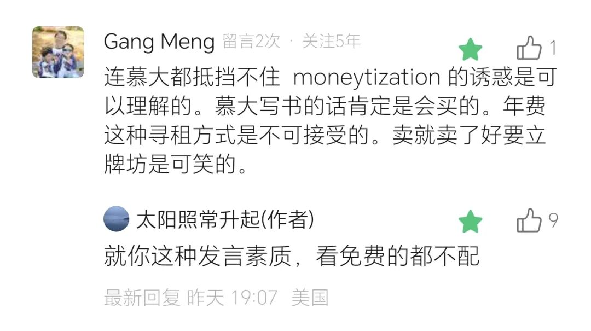

# 演绎法还是归纳法

> 来源: 太阳照常升起

> 发布时间: 2026-04-17

> 原文链接: https://mp.weixin.qq.com/s/V7bTGx3xhvi7ZosXwRZ-kQ

---

这段时间有不少读者询问，如何提升自己的认知能力和结构化分析能力，这是很好的问题，属于认识论范畴。

网络上一门非常好的生意，就是卖课。比如你想投资赚钱，你想开网店赚钱，你想搞直播赚钱，你想写小红书赚钱，你想兼职赚钱，但你又不知道该怎么开始，于是你去搜了一下，然后每天就会收到各种推荐，有不少大师来给你指点迷津。一套课，一堆资料，才卖你299元，甚至29.9元，还有更卷的，9.9元。你一想，这么便宜，打水漂也行啊，于是就买了，然后就真的打水漂了。

这种垃圾资料以前是人工生成，现在是AI生成，效率极高，两分钟生成十套PPT，人家token接近免费，成本就是电费和网费，你花29.9，想想这个利润率有多高。

**所以什么最赚钱呢？教想赚钱的人如何赚钱最赚钱。像不像绕口令**？

如果读者想提高认知能力，作者可以开十门课，不带重样的。这事儿其实还挺赚钱的。你要说没用，多少肯定有点用。作者真要想赚钱，沉下心来，当个AI超级个体，可以卷死很多“同行”。你不要小看这些行业，确实可以养很多人。仔细观察一下，还挺有趣的。

一个会赚钱的人，可以从各行各业展开观察，发现赚钱的点。

但有些读者不行，对赚钱有洁癖。作者也就开了一个星球，还没开始真搞商业化，就开始道德洁癖了，比如以下这位：

你也不知道他是怎样一种扭曲心理。

默默关注五年，基本没有留言，然后来表演一下。作者逼你花钱了吗？作者曾经收你钱了吗？你曾经对这个公众号空间做过任何贡献吗？有过哪怕一次高质量的发言吗？作者认识你吗？作者欠你的吗？你在美国每天吃的是东西是免费的吗？难道每天靠领食品券生存？金牌讲师？金牌讲师人家也靠劳动致富啊，拍短视频也是很辛苦的啊。你既然对赚钱那么抵制，为什么还要待在全世界最热爱金钱的国家呢？那既然你不可接受，免费的也不要看了嘛，已经拉黑了，只能偷偷用其他人的小号来关注了。

当然，没有这些大聪明，这个号以后要少很多欢乐。还是要，多理解他们。

书归正传。

想提升自己的能力，靠阅读或者借鉴他人的经验，当然是一条路。但大量阅读或者单纯占有大量信息往往没有任何帮助。

你身边有没有那种人，家里买了很多书，习惯性收集各种资料，手机里、电脑里都装满了，还分门别类的，最后思维还跟浆糊一样？这种人并不少，对不对？

占有大量信息，在互联网时代已经没有意义了，因为互联网时代大量信息都是垃圾信息。在AI时代更没意义了，因为AI时代一个小学生都可以生成以前博士生才能生成的垃圾信息。

但人们在这个时代对认知能力的渴求是真实的。因为信息爆炸，垃圾信息太多，看什么都感觉有道理，左也对，右也对，怎么谁讲的都有些道理，脑子确实跟浆糊一样啊。

作者还是推崇卡尔波普尔，波普尔的认识论说到底就是推崇演绎法而非归纳法。中国大陆的学生，从小到大，从当小学生到进入社会，最擅长的恰恰是归纳法而非演绎法。这跟教育内容和教育方式有关。

你不能讲中国大陆的教育不好，恰恰相反，从国家间竞争结果的视角看，中国大陆的教育被证明是好的。但对个人而言，如果不理解演绎法和归纳法的差异，占有再多的信息和资料，都是枉然。

作者举一个很现实的例子。

在这次美伊战争开始的时候，为什么很多人“预测”错了。作者跟绝大多数读者一样，在这次美伊战争开打之前，对伊朗的认知几乎是零，这没什么不好承认的，就是不了解。所以这个例子非常好，因为大家在知识储备上，处于同一起跑线，作者没有因为提前占有一些信息，或者有认知储备，就产生任何优势。

单看美以伊战力对比，毫无疑问美以是碾压伊朗的，如果你从经济、军事、政治稳定性、外部支持等各方面来看，伊朗应该顷刻被瓦解，尤其考虑到伊朗在前段时间还发生过内部动荡。

也就是，你把各种条件摆出来，**归纳起来看**，伊朗不但必败，而且会大败，产生一个亲美的政权似乎是非常可能的，或者，至少变成委内瑞拉那样。

这就是归纳法的结论。

在老哈梅内伊核心团队被炸身亡后，作者的感觉也是这样，伊朗完了。

所以你看，看起来“独立思考”，通过AI或者网络或者书籍，收集了很多信息，有详尽的数据，把这些信息和数据归纳在一起，列个表，似乎很清晰地能够看到，美以从各方面都是全面碾压伊朗的，伊朗肯定完蛋了。

但故事没有结束，对不对？

小哈梅内伊还在，然后伊朗没有产生一个亲美的政府，改革派似乎没有声音，小哈梅内伊成了最高领袖。这个事就很刺激了。既然第一次归纳得到的结论是错的，那接下来会发生什么呢？伊朗会怎么做呢？小哈梅内伊能够将IRGC控制住吗？按照欧美的舆论，伊朗的改革派应该顺势上位呀，怎么没有声音了呢？这难道不是他们最好的机会吗？

这时，作者就开始怀疑自己曾经受到的欧美对伊朗的宣传了。

第一个质疑，伊朗的改革派为什么会在关键时刻没有夺权呢？这涉及到伊朗宪法关于最高领袖产生的问题。新知识点吧，以前不了解吧。现在通过AI很容易了解，先看欧美比较权威的研究，不够，再看伊朗波斯文的信源。看完之后，你就会对伊朗的政治架构产生兴趣。你会发现，它其实具有很强的内部稳定性。你看，作者得这个结论，讲伊朗政治结构有很强的内部稳定性，许多读者，只会记住这句话，然后脑子里形成一个思想钢印，就认为这一定是真理，然后去传播。只要是喜欢站队的读者，肯定都喜欢这种结论。那万一作者是骗你的呢？你会去验证作者的这个结论吗？

大聪明此时也会上场，讲伊朗教权那都是靠强制力，伊朗老百姓不得不服从。作者曾经也是这种认识，以为伊朗内部控制很严，毕竟以前新闻看到，女性出门不戴面纱，就要被道德警察审问，这个新闻的印象还挺深的。但现在情况不一样，川普希望的伊朗人民大起义为什么在核心权力最虚弱的时候没有发生呢？那就继续追问，这些说法是真的吗？

稍微了解一下，就知道，伊朗还真不是那样的国家。它的老百姓，在平常使用的社交媒体软件都主要是美国的，然后你去看它的波斯文信息，对IRGC的不满是公开的。你再去问AI伊朗有哪些改革派的学者，他们的主要观点是什么？这就好玩了，这哪里是什么封闭的国家，他们不挺正常的吗？他们不但讨论欧美的制度，还在讨论中国大陆的体制，从各种工业品生产到互联网经济、电动车、AI，他们都在讨论。他们对政治经济问题的辩论很深刻，对伊朗体制问题的讨论既公开也尖锐。甚至到后来，德黑兰一位非常著名的、经常在媒体上公开批评IRGC的改革派经济学家，竟然公开支持伊朗应当控制霍尔木兹海峡，这种转变真是180度。那他们究竟是怎么想的呢？

接下来，真不用只信欧美的报道了。因为此时你已经能够判断，之前宣传很多都是假的、错的。此时必须把波斯文和阿拉伯文信源加入进来。

**这种一步一步的质疑、查询资料验证（证伪）、推导、再质疑、再查询资料、再推导的过程，就是演绎法**。许多人只会质疑，而不会去查找资料去证伪，只会在自己大脑中各种对撞幻想，或者把网上所谓各种现成观点拿来对撞，这不叫演绎，这叫自我飞升。

**演绎法中最重要的一点，就是只有证伪是可信的**。

什么意思呢？也就是，**只有证伪具有确定性，除此之外都是“待证伪”的内容**。这是演绎法为常人所不容的关键，但也是波普尔认识论的关键。

**一切理论都是“待证伪”的，越长时间没有被证伪的理论，越可能接近于人们认为的“真理”**。

对理论如此，对现实的判断也是如此。

对作者这样此前根本不了解伊朗的人，在美伊战争中，被不断证伪的内容，包括但不限于：

1、伊朗是一个非常封闭的国家；

2、伊朗老百姓会起义成立一个改革派主导的政府；

3、伊朗的改革派会与美国通力合作，全力抵制教权政府；

4、伊朗的改革派将会反对IRGC控制霍尔木兹海峡；

5、美国和以色列有足够的能力摧毁伊朗的军备，使其丧失威胁海峡和海湾国家基础设施的能力；

6、美国的航母群可以彻底占领霍尔木兹海峡，攻占哈尔克岛，甚至快速登陆作战，瓦解伊朗的战力；

7、美国和以色列可以通过暗杀、轰炸不断摧毁伊朗的指挥中枢，瓦解和动摇伊朗的抵抗意志；

8、伊朗人民欢迎美国和以色列的进攻，箪食壶浆、里应外合、以迎王师；

9、美国以色列发动的是正义之战，目的是打击伊朗的军事设施和政权，不会对民用设施和老百姓发动攻击；

10、全世界都视伊朗为威胁，美国的盟友都支持这样的行动；

11、伊朗没有对等抵抗能力，拿捏不到美国的七寸，只能被动挨打；

12、伊朗的进攻性武器会被快速消耗殆尽，对海湾国家和以色列无法构成足够的威胁；

13、还有好多。

这就是证伪的可怕之处。

但我们这里讲的是思维过程。每一个思维过程，你都可以进一步反问，伊朗的弱点究竟在哪里呢？有没有可能被美国拿捏住呢？

比如，美国封锁海峡断掉伊朗石油出口路径这个选项，其实是3月底作者就考虑过的，那问题就变成，伊朗能够扛更久，还是美国能够扛更久？伊朗的进口替代路线是什么，伊朗的储备还能支撑其购买多长时间必需的物资，相应的，海峡出口的中断，会造成美国及其盟友哪些必需物资的中断，各国的储备周期，可替代性。这些问题，在3月底，连作者在收费文章中都写过了，各国难道可能没有研究出来吗？

所以什么是演绎法？演绎法就是你生活在现实中，你怎样去一步一步应对，会有哪些可能的情况出现。以及，你当前做出的判断，如果被证伪后，会出现怎样的情况。又例如：

作者在3月底根据新闻报道提出，伊朗与阿曼在商议共管霍尔木兹海峡的问题，伊朗当时已经开始国内立法，且立法内容已经考虑了阿曼是《联合国海洋法公约》缔约国，进而没有采取激进的“通行费”表述，而是采用了“安全”、“环保”这样的表述。这个报道出来之后一周，美国没有任何公开反对，阿曼也没有立即反对。所以作者在当时认为，这可能是美国可以容忍的一条路。因为，川普不可能去赔偿伊朗损失，那就得海湾国家去赔，但海湾国家能直接给钱吗？恐怕也不能。不如通过海峡收费的方式去解决。

那阿曼在什么时候出来讲不可行的呢？在川普讲他想搞海峡joint venture的时候。所以大聪明讲，看吧，你又预测错了，阿曼人家否认了。是是是，大聪明永远脑子里只有当时那个点，永远装不下其他更多内容。如果你像作者一样完整追踪和考虑过整个过程，并且秉持演绎法的思维，那阿曼参与共管“被证伪”并没有什么大不了的，对不对？因为阿曼与伊朗共管海峡这个判断跟其他所有判断一样，都是“待证伪”的。

但这个过程非常重要，因为阿曼如果一开始就反对，它不用跟伊朗谈一周多对不对？它一开始就可以反对，对不对？这说明什么呢？阿曼本身可以是一个白手套，这就是作者在3月底收费文章中的判断，它可以代表美国和海湾国家去当这个海峡共管的白手套，但最终阿曼说了不算，不是它不想，它其实非常想，因为阿曼经济转型困难，且本土人口占比是GCC国家中最大的， 所以它非常想有一个稳定的财政收入来源。但最终的结果是，川普不想要白手套，川普想自己上，搞joint venture，你们都不要来吃差价。

看到没，大聪明脑子里永远只有“预测错”那个点，他们完全不懂“证伪”其实是一个过程 ，证伪本身就内含了非常多信息和判断，同时证伪又会带来更多新的信息和判断，变成一个新的“待证伪”的内容。

好了，这就是演绎法。作者应该是历史第一个这样讲演绎法的人，因为讲理论其实挺枯燥的。如果理论你不能贯通于实践，那是没有任何实际意义的形式逻辑。**形式逻辑不重要，现实逻辑才重要。演绎与不断证伪最重要**。

那么，这篇免费文章的价值有多大呢？是不是比那些29.9甚至299对你的价值更大呢？

以上。

**观赏更多演绎法思维，欢迎加入作者的知识星球**！

---

*本文抓取时间: 2026-04-17 12:10:45*
