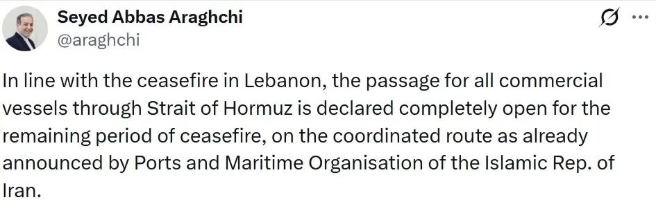
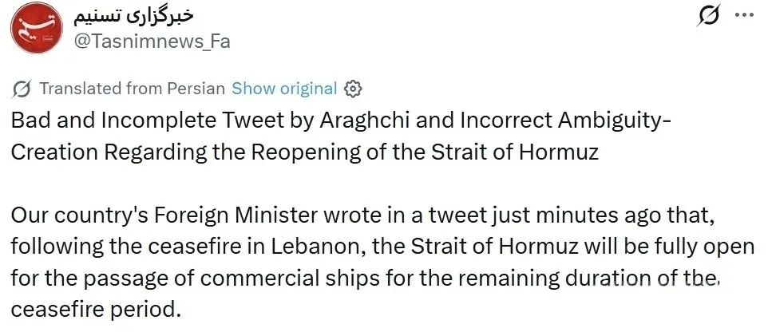
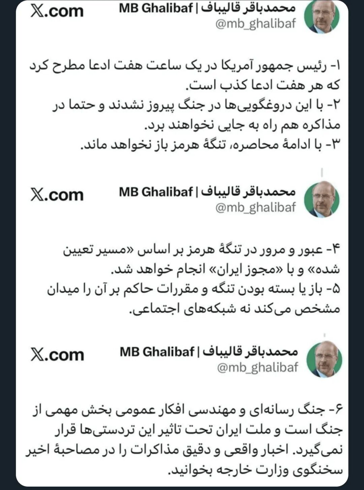

# 川普的K线又画歪了

> 来源: 太阳照常升起

> 发布时间: 2026-04-18

> 原文链接: https://mp.weixin.qq.com/s/t1aMkSul--H0rtzjl5ulaQ

---

昨晚，伊朗外交部长阿拉格齐的一篇推文引发了全球“误解”：

尽管他讲的是，“在剩余停战期内”，遵循伊朗的“协调路线”，但由于出现了“所有商业船只通过霍尔木兹海峡的通道将完全开放”这一说法，使得川普找到机会疯狂输出，又画了一个很大的K线图。

**阿拉格齐的发言随即被代表伊朗革命卫队（IRGC）的Tasnim通讯社公开痛批**：

Tasnim连发数贴，重申海峡并未完全开放，IRGC实施全面监督，并且明确指出“外交部必须重新考虑这种沟通方式”。

**这是开战以来，伊朗内部第一次出现如此大的分歧**。很显然，阿拉格齐的推文并未真实反映伊朗内部对海峡的态度，或者说，**在海峡问题上，伊朗外交部说了不算，真正拥有发言权的是IRGC**。阿拉格齐轻率的发言给了川普又一个表演的机会。

在昨晚Tasnim尚未表态的时候，作者就讲，如果谈判对伊朗不利，“IRGC是不会干的，到时伊朗就不是一个整体了，IRGC会体现自己的独立性。反过来。为了压住IRGC，伊朗领导层在核心利益上不可能松口。”（《[美伊双方都表达了停战的诚意](https://mp.weixin.qq.com/s?__biz=MzI0ODE5NDU5Mw==&mid=2649551861&idx=1&sn=e29b2637267c4be21a0a6cb88466b742&scene=21#wechat_redirect)》），很快就应验了。

川普的每句话都不可信，霍尔木兹海峡的控制权在伊朗而不是美国，很多人就是理解不了这点。

Tasnim昨晚公开了这个短暂停战期间海峡通行的规则，有三条：

1. 船只必须是商业性质的，禁止军事船只通行，且**船只和货物均不得与敌对国家相关**。

2. 船只必须通过**伊朗指定的航线**。

3. 船只通行必须与负责通行的伊朗部队协调；正如中央司令部（CENTCOM）在战前所确认的，**伊斯兰革命卫队（IRGC）对霍尔木兹海峡拥有管理权**。

**这次的允许通行，更像是在减轻海峡内侧大量滞留商船的压力，这些船只属于很多国家，一直滞留海峡内侧，补给严重不足，如果再待下去，可能会引发这些国家对伊朗的不满**。这跟“海峡恢复通行”还差得很远。同时，这个暂时恢复通行，也与黎巴嫩停火挂钩。如果以色列恢复对真主党的进攻，那通行就结束了。

Fars News也报道了伊朗国防部副部长尼克的讲话：“霍尔木兹海峡仅在停火状态下以有限方式开放，条件是敌对国家和相关军事船只无权通过霍尔木兹海峡。”

伊朗谈判首席代表，议长卡利巴夫也连发数条推文，表示“美国总统在一小时内提出了一个主张，而这个主张每小时都在被证伪”，“尽管这场战争每天都在持续，且谈判也在进行中，但美国在这些谎言中仍试图为自己寻找出路”，也重申了海峡开放的原则是获得伊朗许可。

面对川普的再次混淆视听和挑衅，伊朗的愤怒不止于此。

Fars News最新的封面文章中，再次提到了阿曼湾和曼德海峡。**伊朗的阿卜杜拉希少将昨天明确向美国宣布："如果你们继续在该地区（指霍尔木兹海峡）实施非法的海上封锁，我们将不允许波斯湾、阿曼湾和红海地区的任何进出口继续进行。"**

作者已经讲过很多次，鉴于川普团队的各种言而无信，美国侧的单方说法已毫可信度，对于美伊谈判的进展，均需以伊朗侧确认为原则。

阿拉格齐昨天犯了一个严重的错误，被川普狠狠摆了一道，无论有意还是无意，阿拉格齐向外界只证明了一点，他在谈判事项上确实没有任何发言权。

昨晚美伊的这一轮小表演，又很好的印证了昨天作者在《[演绎法还是归纳法](https://mp.weixin.qq.com/s?__biz=MzI0ODE5NDU5Mw==&mid=2649551852&idx=1&sn=3ec1cfc6deac039d91182b067945c429&scene=21#wechat_redirect)》中提出的“待证伪”的重要性。对于川普的任何发言，不仅是待证伪的问题，而是应该倾向于就是“伪”，然后来看看反驳什么时候出现。

**从昨晚到今晨伊朗各方的表态中，能够得到的信息是：**

**1、伊朗不会放弃霍尔木兹海峡控制权，他们知道这是对抗背信弃义的美以的唯一武器；**

**2、伊朗同意利用短暂的停战期清空海峡内侧大量滞留的友好国家商船，减轻来自各国的舆论压力，但前提是以黎维持停火；**

**3、如果美国继续封锁霍尔木兹海峡，伊朗可能随时开始封锁曼德海峡，届时巨大的压力会再次给到川普**。

以上。

**更多深入讨论，欢迎加入作者的知识星球**！

---

*本文抓取时间: 2026-04-18 11:16:32*
