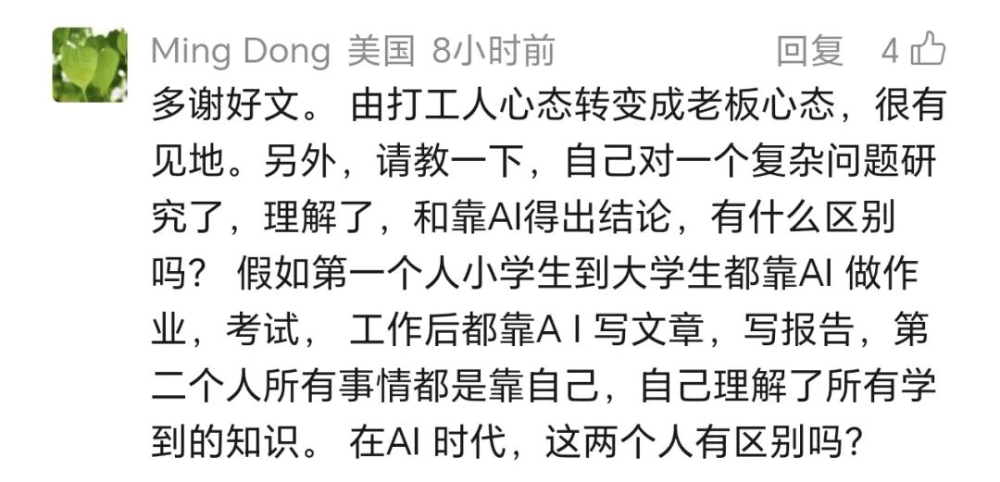

# AI时代的基础教育

> 来源: 太阳照常升起

> 发布时间: 2026-04-29

> 原文链接: https://mp.weixin.qq.com/s/ZAV-yLpt-Fp4I282gSzGuw

---

昨晚作者发表了很重要的一篇文章《[AI时代如何寻找就业方向](https://mp.weixin.qq.com/s?__biz=MzI0ODE5NDU5Mw==&mid=2649551948&idx=1&sn=06d0cc14ee06e16b10289068105f989b&scene=21#wechat_redirect)》，有很多读者还没看到，可以先行阅读。

为什么说很重要呢？因为作者会以这篇文章为开端，结合自己对AI深度使用的理解，提出一系列原创性观点。

昨天一位读者在阅读该文后，提出了以下问题：

这是一个非常好的问题。我们可以再深入一下，学生如何在AI时代学习，或者再换个视角，AI时代如何教育。

作者用一个类比，就可以很清晰地理解我们的基础教育意味着什么。

**基础教育其实就是对大脑的预训练**。

与AI的预训练一样，基础教育向个体提供“基础知识”（对应AI的世界知识），让个体理解“知识链”（获得常识），习得基础的语言技能（分析技能）。差异在于，个体在长达12年的基础教育中习得的知识与技能是非常少的，并且能力的形成是因人而异的。

好的基础教育内容，类似优质的世界知识数据库；差的教育内容，类似一堆垃圾数据。好的老师帮助形成好的技能、搭建清晰的知识链，并在此过程中形成自学的能力，这跟一个优质模型的形成是类似的；但差的老师和方法，自然就只能对应一个垃圾模型。

区别在于，AI本身可以成为新时代的老师。作为中间人的老师，被替代性非常强。

**但比起AI的预训练，人的基础教育还有另一个特殊之处是AI没有的。那就是人在接受基础教育过程中，形成的自我感受**。包括习得的愉悦感，学习过程中的挫折感（包括低分反馈导致的），以及在面对挫折时坚持下去的毅力。

在AI时代，学习的考查目标，应当包括：

一是基础知识链的建立，也就是传统的知识教育；

二是在学习过程中反复体会各种感受，并形成积极的应对心理，尤其是培养自己的兴趣。

**过程感受及其应对能力比结果重要，心理比分数重要，兴趣最重要**。

人的大脑不可能比AI的知识储备还要多，反应也不可能比AI还要快。所以如果目标还是曾经的内容考查，就变得毫无意义。

不是讲不需要考查内容，而是讲，内容的习得目标是为了建立基础的知识链（基础知识体系，或说，常识），以及在这个过程中让受教育者经历各种感受，培养他们的心智，让他们找到自己擅长的兴趣，以及培养应对负面情绪的心理承受力。

衡水模式在未来可能是最失败的教育模式。衡水模式是典型的工业时代遗迹，以寻求一个“永不倒塌的温暖组织”为终极教育目标，但损耗了培养人生兴趣最佳的时光，甚至会导致终身厌学。

我们要理解，人与AI的终极差异，在于人能够识别需求。人是最终的需求产生者，AI除了对电力有需求（假设它自己知道），它没有任何别的需求。

**所有需求都是人类产生并最终由人类识别的，这是AI时代最底层的逻辑**。

所以，**如果把人教育成生产的螺丝钉，或者把自己训练成打工机器，那你未来被炼化成skill的可能性是极大的**。

如果你逐渐感受作者的观点，看到AI时代与过往的巨大差异，建立起自己是需求产生者和识别者的终极意识，并且在此过程中去不断扩展兴趣的广度和深度，在真实世界通过自己的感知训练不断捕捉到新的需求，那AI时代对你而言将是一个美好的时代。

以上。

**拒绝成为别人的skill，欢迎加入作者的知识星球**！

---

*本文抓取时间: 2026-04-29 09:22:10*
