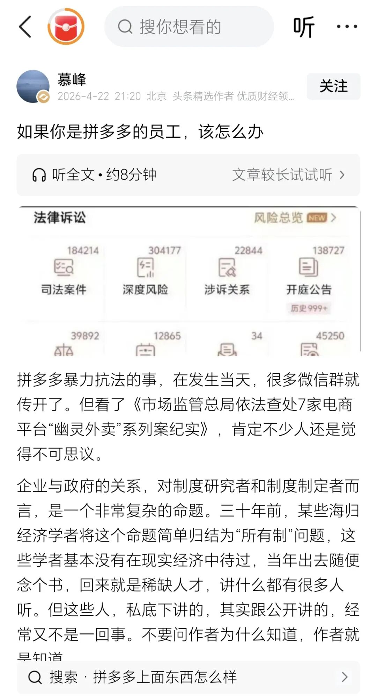
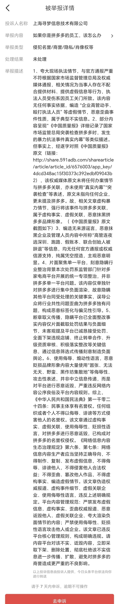
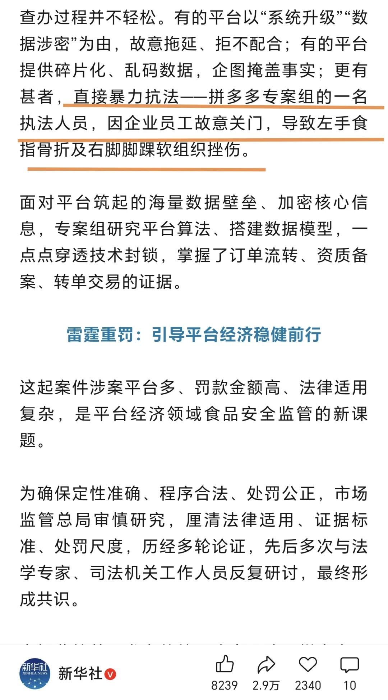

# 对拼多多恶意举报作者的公开回应

> 来源: 太阳照常升起

> 发布时间: 2026-04-29

> 原文链接: https://mp.weixin.qq.com/s/_IZRpLOPCTeyxwgl-lFX7g

---

4月22日，本公众号发表了《[如果你是拼多多的员工，该怎么办](https://mp.weixin.qq.com/s?__biz=MzI0ODE5NDU5Mw==&mid=2649551897&idx=1&sn=9f5c80659144a7262c6b44269b639f8b&scene=21#wechat_redirect)》，同日，作者在今日头条号也原文发表同样的文章：

作者平时也不怎么管今日头条，今天打开一看，发现**今日头条后台多了一条来自“上海寻梦信息技术有限公司”的举报**，拼多多就是其旗下的赴美上市公司。作者认真看了一下这条投诉，可有意思大发了，奇文共赏析：

作者在拼多多举报的《[如果你是拼多多的员工，该怎么办](https://mp.weixin.qq.com/s?__biz=MzI0ODE5NDU5Mw==&mid=2649551897&idx=1&sn=9f5c80659144a7262c6b44269b639f8b&scene=21#wechat_redirect)》一文中，只有两处提及了“拼多多”三个字，一是文章题目，二是文章第一句“拼多多暴力抗法的事……”。除此之外，再无任何“拼多多”字样了。

**鉴于拼多多有这么认真的举报，作者必须认真的、逐条的回应，以不辜负拼多多的厚爱。请各位读者尽量逐字认真阅读**。

**拼多多举报内容1：**

“夸大现场执法情节，与官方通报严重不符根据国家市场监督管理总局及权威媒体通报，相关情况为当事人存在不配合提供材料、提供虚假信息等行为，执法人员受伤系因员工关门所致。该内容无任何事实依据，**编造 “企业高管动手、殴打执法人员” 等虚假情节**，恶意歪曲事件性质，属于典型不实信息。”

**作者回应1：**

**作者的文章中，根本就没有任何拼多多“企业高管动手、殴打执法人员”的内容。这是拼多多自己臆想出来的吗？为什么臆想得这么形象具体呢？怎么作者都完全没有提及，拼多多反而描绘得那么生动呢？难道是你们的员工自己在现场亲眼看到的**？

**拼多多举报内容2：**

“部分内容呈现“《中国质量报》详细记录了国家市场监管总局突袭检查拼多多时，发生的暴力抗法事件真实内幕”等类似描述。但事实上，经逐字对照《中国质量报》原文（链接：http://share.591adb.com/sharearticle/article/article_id/6576003/app_key/4dcd348ac15f30373c392edbf09043b2），**该权威媒体原文未将任何办案情节与拼多多关联，亦未使用“真实内幕”“突袭检查”等表述，原文未指向任何企业，更未提及拼多多**。故，相关文章虚构暴力情节，强行将该事件与拼多多关联，属于虚构事实、虚假关联，恶意抹黑拼多多品牌形象。（《中国质量报》原文截图如下）”

**作者回应2：**

作者文章根本就没有关心过什么“真实内幕”，也没有任何拼多多暴力抗法过程和内幕的“类似描述”。拼多多表示，作者引用的《[市场监管总局依法查处7家电商平台“幽灵外卖”系列案纪实](https://mp.weixin.qq.com/s?__biz=MzA3MTc4MjkzMA==&mid=2650582048&idx=1&sn=2b1d7ec173ff26cd39b9eb88b191ccb2&scene=21#wechat_redirect)》，“**原文未将任何办案情节与拼多多关联**......**原文未指向任何企业，更未提及拼多多**”，意思是，《中国质量报》的报道没有写出“拼多多”三个字，所以该文中提及的“发生暴力抗法事件”，与拼多多无关，所以是作者在“抹黑拼多多品牌形象”。

行，作者承认，尽管大家都知道该文讲的暴力抗法事件就是在市监局检查拼多多过程中发生的，但该文确实给拼多多留了面子，就是没有单独出现“拼多多”三个字。既然拼多多不要这么大的面子，那作者就只能引用另一家更权威的媒体了。

**请看新华社4月18日的报道（**《**[一份蛋糕订单牵出巨额罚单**](https://mp.weixin.qq.com/s?__biz=MzA4NDI3NjcyNA==&mid=2650209775&idx=1&sn=05875766b1f9041d29ad2b049d2fa583&scene=21#wechat_redirect)》**）

新华社讲的拼多多暴力抗法，拼多多，这次承认吗？作者是虚构的吗？作者是强行关联的吗？

**拼多多举报内容3：**

“编造无来源谣言，恶意抹黑企业及管理人员内容中所称**“高管连夜逃深圳、跑路、假账本、联合创始人被辞退”**等信息，均无任何官方通报或权威信源支持，纯属凭空捏造，主观恶意明显。”

**作者回应3：**

作者文章中根本就没有任何上述拼多多**“高管连夜逃深圳、跑路、假账本、联合创始人被辞退”**的内容，到底是作者在虚构？还是拼多多自己在虚构？

**拼多多举报内容4：**

“**片面聚焦单一平台，刻意隐瞒行业整治背景本次处罚系监管部门针对多家电商平台开展的统一专项整治，并非拼多多单一平台问题。**该内容仅单独针对拼多多进行集中负面渲染，故意隐瞒其他平台同受处理的关键事实，误导公众将行业共性问题歪曲为拼多多独有问题，构成恶意标签化与偏见性引导。”

**作者回应4：**

市监局查处七家电商平台的报道出来后，大量自媒体确实都在针对拼多多，难道不该针对吗？你暴力抗法，老百姓看不下去，还不能讲？

问题是，作者那篇文章，恰恰是为数极少，没有专门针对某个平台，而是通篇都在讲平台监管的。该文也在提醒很多打工人，你为公司暴力抗法，公司只会认为你违法，不可能反过来维护你。这难道不是很现实的法治教育吗？

作者又不是今天才开始讲这些，作者早在8年前就在讲了（《[是时候彻底反思中国的互联网经济了](https://mp.weixin.qq.com/s?__biz=MzI0ODE5NDU5Mw==&mid=2649548901&idx=1&sn=fb6666b027966dde91cf1e4c3eede7ae&scene=21#wechat_redirect)》），拼多多刚入职的公关和法务小朋友，问问你们的高管，有几个当年没读过作者8年前那篇文章的？再问问你们的师兄、师姐，有几个不知道作者的？

**拼多多举报内容5：**

“断章取义传播，隐瞒平台已全面整改事实内容**仅片面截取处罚结果与负面细节**，未客观提及平台已诚恳接受处罚、全面下架违规店铺、终止转单合作、升级资质审核、积极落实整改等关键信息，通过信息筛选式传播刻意制造负面舆论。”

**作者回应5：**

作者倒是后悔了，为什么文章中就是没有讲拼多多的“处罚结果与负面细节”呢？这要讲了，不就能满足上述举报的内容了吗**？所以讲你拼多多的处罚结果和负面细节就是过错？你拼多多的负面细节不能讲？只要写文章就只能讲你“诚恳接受处罚、全面下架违规店铺、终止转单合作、升级资质审核、积极落实整改”是吗？**请问是哪部法律赋予你这么天大的权力？

**拼多多举报内容6：**

“**使用侮辱、煽动性语言，恶意贬损品牌形象内容大量使用“嚣张、无法无天、野蛮、黑作坊集散地”等侮辱性、攻击性表述**，并非中立信息传递，而是对平台进行恶意诋毁，严重违反网络内容公序良俗及平台内容规则。”

**作者回应6：**

看到这里完全不能理解，为什么拼多多负责举报的员工和领导，都不看作者的文章，就开始**编造作者文章中存在“嚣张、无法无天、野蛮、黑作坊集散地”**等侮辱性、攻击性表述呢？作者文章中根本就没有这些内容。你们这么根本不看文章就乱举报，作者还得公开回应这么一篇，这究竟是作者在侮辱你们呢？还是你们**自取其辱**呢？

**综上，鉴于拼多多在对作者文章的举报中，显示出拒不承认其暴力抗法事实，且恶意编造作者文章中根本不存在的内容进行恶意投诉：**

1、考虑到拼多多在暴力抗法事件发生并全民皆知后，仍然从内心抗拒存在暴力抗法的事实，**建议市场监管部门**继续加大对拼多多的日常监管力度。作为普通消费者，作者非常担心这样的企业再次侵害消费者权益。

2、考虑到拼多多上述恶意举报很可能不仅是针对作者而是针对广大网络自媒体，**建议网信管理部门**对此滥用网络举报投诉权利的行为予以查处。

3、**建议各家媒体平台**坚守法治和道德底线，为我们每个人和家人的身体健康考虑，为中国所有消费者考虑，对拼多多的恶意投诉行为进行联合抵制。

4、作者保留进一步追究拼多多恶意举报行为的所有权利。

以上。

**坚守法治与道德底线，欢迎加入作者的知识星球！**

---

*本文抓取时间: 2026-04-29 14:22:11*
