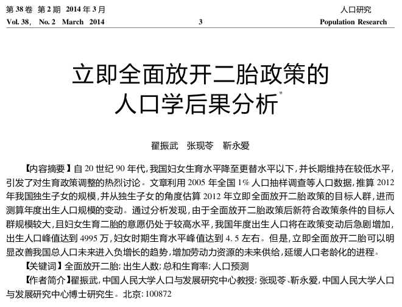

# 又到了聊房价的时候

> 来源: 太阳照常升起

> 发布时间: 2026-05-08

> 原文链接: https://mp.weixin.qq.com/s/GoOZOfQaoi4ujKtNMsAmvA

---

上一次聊房价，还是两年前（《[聊一聊最近的房地产](https://mp.weixin.qq.com/s?__biz=MzI0ODE5NDU5Mw==&mid=2649550836&idx=1&sn=51db7b49c6e1934fd563abe81f2b447a&scene=21#wechat_redirect)》）。十年前，这个公众号的第一个话题就是房地产。

一直以来，房地产相关行业都在等待房价企稳，那到底企稳没有呢？

房地产这个市场跟证券市场不一样，它天生杠杆，具有很强的民生属性（居住、教育），跟人口结构高度相关，跟地方就业和收入状况也密切相关。

过去二十年，房地产行业最大的误判，就是对开放二胎后究竟新增人口会增加多少的判断。2014年，时任中国人口学会会长、中国人民大学人口与发展研究中心教授**翟振武**与两位博士生在《人口研究》发表了《立即放开全面二胎政策的人口学后果分析》，提出：“由于**全面放开二胎政策后**新符合政策条件的目标人群规模较大，且妇女生育二胎的意愿仍处于较高水平，我国年度出生人口将在政策变动后急剧增加，**出生人口峰值达到4995万，妇女时期生育水平峰值达到4.5左右**”。

尽管中国大陆人口学界这篇论文的结论有过“商榷”，但商榷的论文，也认为放开二胎后，年度出生人口峰值在2200万至2700万之间（乔晓春，北京大学人口研究所，2014）。

如果现实的新增人口数量能够达到哪怕上述“商榷”的水平，房价持续下跌的基础恐怕都不会存在了。

今天的现实是，2025年出生人口仅792万。

**2015年的涨价去库存有没有上述人口学研究作为支撑？答案是：有，并且很关键**。这就是社科研究的可怕之处，它确实可以对现实产生巨大的影响。

所以现在还在考虑房价是否反弹、是否该投资房产，是怎样一种考虑呢？

作为年轻人，今天需要买房吗？

如果还没有到结婚生子的年龄，异地谋生，如果身处一二线，租房显然是非常划算的。一二线的房租一直在下降，即便在一线城市，不少曾经高价出租的房屋都很难租出去，有个长期租客房东都要感恩戴德，租金降都是小事，怕的是租不出去。

曾经一二线的年轻人为什么要买房？

一是为了下一代教育，二是因为房东不断涨房租、还要随时被房东赶走。

现在这两个原因还存在吗？

既然可以安心租房，那还着急买房做什么呢？城市新增儿童越来越少，幼儿园都在改成养老院，小学马上都要招不够人了，到时还会因为你没有房产所有权而拒绝你入学吗？

二三线的房租是真香。年轻人不再为住房问题而难受了，该感谢谁呢？

再说工作收入。

目前年轻人还有高收入的城市，似乎不多。还在诞生资本造富神话的城市，当然可以短暂接受某些高价的新房，但这是投资需求产生的吗？十年后还有接盘的吗？

房价指标本来就是不可靠的。作者十年前就写过中国大陆房价的生成机制，新房与二手房一定要分开来看。新房定价本来就可以完全脱离二手房价，但如果非要从投资视角看，二手房价才更真实。

抖音上有一些探房的博主，不断找到各地的“鹤岗”，真是不看不知道，一看真奇妙。一些面朝大海、春暖花开的小城市，三甲医院不缺，高铁不缺，配套不缺，四季如春，房价多少呢？说出来都吓死人，一年房租才几k，也是前几年大开发商建的，居住质量不知道比一线老破小强了多少倍。关键整个小区都在抢租客，真正的买方市场。

你就说，如果是通过网络卖字、做视频或者个人投资获得收入，住那些地方不好吗？

作为老登，你也许觉得房价、房租已经降了很多了，那你不妨换个视角，如果你是年轻人，面对一线400w的房价、4k的房租，二线200w的房价、2k的房租，以及“新鹤岗”20w的房价、500的房租，你会怎么选呢？

年轻人躺平不合适，但没苦硬吃，恐怕也不合适吧。

（文章封面图来自抖音博主“包子全是水”）

以上。

**拒绝没苦硬吃，欢迎加入作者的知识星球**！

---

*本文抓取时间: 2026-05-08 12:00:26*
