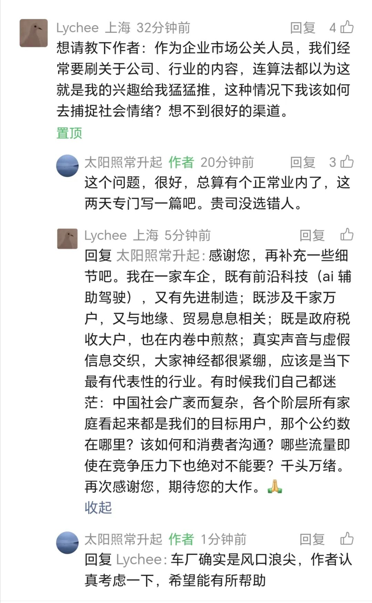

# 大企业如何避开互联网舆论的坑

> 来源: 太阳照常升起

> 发布时间: 2026-05-11

> 原文链接: https://mp.weixin.qq.com/s/3GJQOcm9Zi7gyeXudvWG5g

---

昨天《[为何一些大企业对社会现实缺乏感知](https://mp.weixin.qq.com/s?__biz=MzI0ODE5NDU5Mw==&mid=2649552018&idx=1&sn=40e3ab31ea326b0c1e11c950640469ae&scene=21#wechat_redirect)》以OPPO“两个妈妈”舆情事件为例，谈到了大企业的市场公关问题。

一位读者在留言中提出了一个问题：

作者不是传媒出身，也没在媒体待过，当年开始写这个公众号，本就是看不惯越来越乌烟瘴气的互联网舆论。多年过去，互联网舆论生态当然发生了一些变化，但越来越多的实体企业，反被裹胁其中，苦不堪言。

由于这个公众号写了十年，作者也变成互联网舆论中的一分子。但像作者这样的自媒体其实并不多，因为在作者这里，随心讲话比接商单重要一百倍。但大多数自媒体不是这样的，行业媒体更不是这样的。

**除了这个公众号和知识星球之外，作者从来都不在网络上留言，作者相信，这是绝大多数老百姓的常态。真正留言的人，可能只是现实中的九牛一毛**。企业如果不能理解这一点，轻信所谓的“互联网大数据”、“算法推荐”，很可能会吃大亏、上大当。

当然，采购这些数据、算法推荐，已经成为行业惯例，因为除此之外，大企业似乎很难有足够的依据，去做判断。都是打工人，你写个文案，设定一个企业文化方向，如果没有任何依据，出了问题，可能就要掉工作，因为上级会认为你是拍脑袋想出来的。所以，采购互联网大数据、算法推荐，用一些花花数据证明自己的思考和判断是有依据的，似乎就成了生存的必要步骤。

如果这些数据可信，这些算法能够反映真实情况，也不是坏事。但问题在于，**我们的互联网舆论数据，在绝大多数人根本不会发言的时候，尤其是，当收入水平越高，越重视个人隐私，越没可能在网上发言的时候，这些“网络舆论”判断，还有效吗**？

为什么在企业内部讨论时没有争论，甚至看起来跟网络舆论还十分契合，一放出来就坠入地狱？为什么别人玩梗收获的就是比心，你玩梗收获的就是血淋淋？

**关键是提出方案的人和做决断的人**。

**如果提出方案的人，是一个小圈子文化的拥趸，而做决断的人，是网感奇差无比的老登，那就是绝配。历次大企业的网络负面舆情，这种搭配不在少数**。

表面看，这是企业招聘出了问题。

现在越来越多的企业，在招聘时开始关注年轻人的心理状态，开始要求做心理测试，这是对的。

**其实问题出在三个方面，都跟环境有关：**

**一是学生侧**。由于学籍人口峰值的逐渐到来，现在的学生从中考、高考到考研，几乎都只能是杀出一条重围，也就是，他们只能在每一轮不断“干掉”自己的同学，才能获得升级。**优绩主义**是时代和社会客观施加给他们的，那当他们成年、进入社会后，发现现实中的996、007与PUA是十分熟悉和对味的。**越是这种压抑环境中成长出来的人群，越容易走入各种亚文化圈**。这既是优绩者有限的时间决定的，也是互联网原住民一代圈层化的社交选择决定的，还是不少优绩者的心理释放方式决定的。**各种亚文化圈以非主流生态出现，形成了自我循环的经济系统，社交圈层的自我强化无处不在**。在996、007的企业中，年轻员工根本就没有多少自己的线下生活，他们每天就是生活在社交媒体中的，所以他们看到的、感受到的，就理所当然地认为那是正常的、主流的。杠精为什么越来越多，因为他们认为这种语言风格是正常的，一直就是这样。

**二是学校侧**。做市场公关工作的学生，往往是传媒、市场甚至中文等文科专业出身。高校这些专业的教师们是远离社会经济现实的。如果他们在市场上待过，他们就没机会在学校升职，就不可能评成副教授、教授，但如果他们没在市场上待过，他们有什么能力去培养市场需要的人才呢？这些专业的老师，在校内的评价机制也决定了他们的行为方式。在评上教授之前，课要讲得好，学生评价要好；论文要写得好，核心期刊要发表得多。前者就是要取悦学生，怎么取悦呢？面对无知的学生，基于自己对现实的无知，疯狂抨击各种时事，而不是帮助学生厘清纷繁复杂社会经济问题背后的成因；对学生不了解的现实冷嘲热讽，与学生的荷尔蒙发生共振，体现自己“独立自主”的精神，往往就是最好的取悦方式。这种老师在过去很长一段时间，都是最吃得开的。**这种生态下养出来的学生，他/她的价值观，也就可想而知**。当然现在也有了改变，主要是网络舆论的整体风向还是变了，但对小圈子的影响可能还不大。

**三是企业侧**。Marketing本来是一个非常重要的工作，也是一个非常重要的专业，**真正好的Marketing，是通过识别客户不同层次的需求来决定产品方向，最终实现产品与与需求的契合，理想的顺序，是Marketing在产品设计之前**。这也是为什么菲利普·科特勒要以need、want、demand来划分需求的三个层次。但现实是，市场营销、传媒乃至其他文科专业，都变成了写推销文案、跑推销现场。产品完全交给生产部门，无论产出什么，销售部门都要变着法的说好。**直接接触客户的市场部门本应该是最了解的客户，最后变成了客户发泄情绪的冤大头**。

企业的客户需求调研，都交给第三方进行，第三方为了压缩成本，包给第四方。以车企为例，现在几乎每个车友群不定期都有打着调研旗号，给小红包，要求车主填写问卷的。你问问有几个车主会写真实信息的？绝大部分根本不会参与。你卖60、70万一辆的车，调研一次给人50元，还要填那么多人个人信息，可能得到真实的反馈吗？很显然，许多车企的市场调研费已经被层层盘剥到几乎不存在了。市场部的负责人如果不了解这些情况，那就没有任何资格干下去。那如果你们都知道了这种情况普遍存在，又为什么没有改变呢？

**说到底，这又不只是市场部的问题，而是管理层的问题**。新势力的老板都是当年的年轻人，在开始奋斗的时候，是以“素人”和“革命者”的身份出现的。那时候他们的消费者感知能力很强，确实知道消费的痛点。痛点就是需求，消灭痛点就是满足需求。这就是为什么新势力在初期大受欢迎的原因。

但随着曾经的革命者逐渐上位，融资、上市、应付各种高大上的场合，逐渐也就开始远离消费者。企业官僚文化开始泛滥，车企之间的网络互害加剧。既要让自己的产品出圈，又要防止竞对乃至网络媒体的恶意攻击，最终发现，行业利润率还不到4%。

还有时间关心消费需求的变化吗？一些细微的需求反馈，如何获得呢？

**有不少车主在网络上反映一些车的问题，竞对就加入搞抹黑，车企为了防御，公关部养的网络喷子就开始对车主群起批判。车企之间的互害，变成了车企对车主的恶意。现在有些品牌已经出了名，只要你买了，出什么事就得认，否则在网上反映问题，肯定没有好结果**。

**这真是消费者的悲哀。这种恶臭之风，是对品牌有益呢？还是有益呢**？

**这种车企舆论环境的形成，就是网络舆论丛林文化的一个体现。所谓“互联网思维”，就是毒害中国大陆商业环境最深的思维**。

由于某些车企的公关部开始动用资源通过车圈媒体抹黑其他车企，其他车企就必须反抗，也就因此增加了其他车企的公关支出。最后大量车企费用流向了车圈的黑公关。这些黑公关很可能与车企公关部（或者其中某些人）有千丝万缕的联系。这一条越来越黑的产业链，难道真有利于产业发展吗？

从网络舆论视角进行外部治理显然是一条道路。现在车企老板们也搞明白了，互害最终就是多输。

从互联网平台企业开始，公关部就是一个糟糕的部门，一开始是为了应对网络舆情，再到后来，成了制造网络舆情的部门。这种互害体系下，各自都苦不堪言。

**这需要车企老板们自己坐下来认真协商，要不要一起“除四害”。头部企业如果不能带头形成规矩，不切除机制的毒瘤，那永远都走不出来。不要认为事事都是官方的问题，这就是大企业之间的问题**。

过去十年，作者反复讲，现代社会的反垄断、反不正当竞争、消费者权益保护和劳工保护就是收拾大企业的，如果你是大企业，尤其你是大产业中的大企业，并且是有诸多上下游和天量消费者的大企业，那你就要认。这就是现代社会，这一课，今天你不上，明天也得上。不要觉得所谓高科技制造业跟互联网平台不一样，在面对这些关系的时候，都是一样的。

**大企业，尤其是面对天量终端消费者的大企业（包括车企）的管理层，要谨慎看待你获得的消费者反馈信息。你首先要思考，在现有网络舆论被各种公关费和网络流量文章、视频搅成浑水的前提下，到底还有哪些信息是真实的**。

懂车帝、汽车之家这些车圈社媒中有多少车主真实的留言呢？还是4S店被派的任务呢？还是极个别收入不高的车主为了挣点小礼物而去留的言呢？这种KPI考核得到的大多数都是虚假数据、虚假反馈，根本不是消费者真实的声音。

**那大企业究竟应该怎样面对这种舆论环境呢？如何才能不掉坑呢**？

作者金玉良言，免费提供几条思路，这几条，可能比很多企业花重金聘请那些专业机构得来的建议更有用。

**1、几家大的车企老板身体力行，建立行业自律标准，全面颠覆现有的车企互联网公关体系**。如果底层机制保持不变，互害继续是一定的。能不能改变，作者不知道，反正全行业不到4%的利润率，还天天网络互害，也不知图什么。这种基于地方支持的汽车行业发展模式是不可能靠出海就获得新生的。车企的大规模重组迟早会发生，晚发生不如早发生。行业风口期过了，进入成长期，公关费都砍了，很多激进的问题就会自然缓解。

**2、远离小圈子**。汽车是面向普罗大众的产品，即便有细分市场，但绝对不应与当前各种非主流小圈子产生关系。作为车企，难道你会把女权、LGBT、Cosplay、二次元、饭圈话题当成自己的卖点吗？你确定这种话题是你理工科制造业从业者能把握得住的？要接近年轻人，不需要这样的话题。不要像房地产行业当年那样搞不清人口结构，去详细了解一下，各地人口结构，到底还有多少年轻客户值得你这么关心。为了少数年轻客户，得罪真正能付费的中登、老登，有必要吗？

**3、远离网红代言**。网红都是极端的，不极端不可能成网红。实在搞不清楚作者什么意思，就自己去开个公众号、微博，写两年，看看后台各种奇葩言论，就明白了。任何一个大网红，在拥有众多粉丝的同时，也拥有众多黑粉。有些人看起来很红，但现实中大多数人是非常讨厌的，只是他们不会在网络上留言罢了。**你选择任何网红做代言，就是跟更多的潜在客户做敌人。大多数消费者并不会因为喜欢某个代言人而消费，但肯定会因为讨厌某个代言人而不消费**。还有一些奇葩市场部，把各类网红都叫来代言，美其名曰“多元化”，怎么说呢，你的市场总监可能是收了竞对的offer了，开了吧。

**4、谨慎选择你的员工**。对新入职员工一定要做心理测试、性格倾向测试。现在的心理测试内容其实并不贴近实际。这其实是个大市场，不知道搞人力招聘是否明白？不只要通常的心理测试，还要价值观测试。把各种现实发生的事件变成测试内容，看看应答的反馈。这里面没有对错，只有是否契合。**如果不契合企业的价值观，无论能力多强，一律不应该录取**。

**5、建立独立的消费者反馈和评价机制**。如果你已经对采购的消费者画像数据不信任了，那你必须建立独立的消费者反馈和评价机制。这是企业的痛点，也是绝佳的需求点。这不是下KPI就能解决的，KPI只能带来虚假反馈。对车企而言，不要把问题想复杂了，消费者没有那么复杂。

**6、市场部门要有足够的网络舆论感知力**。网感，网感，还是网感。这是很矛盾的一件事。如果你的员工网感十足，能够识别各种梗，说明他/她可能就是小圈子的一员；如果你的员工网感比较差，那就很可能掉进圈子话题里。怎么办呢？**可以尝试建立一些内外部联合机制，组织不同的人群，来对所有文案进行联合审查**。

**7、抓紧把AI用起来**。车企天天号称世界模型、AI化，但文案审查都不用AI的吗？行业黑话，小圈层的舆论黑话，让AI去整理一下不好吗？文案让AI参与审查不好吗？不断更新这样的skill很难吗？**把AI用起来，把公关费砍下去，把成本用在刀刃上，而不是宣发上**。车圈那些津津乐道的“专业”话题绝大多数消费者其实一点兴趣都没有，甚至完全不知道你们在扯什么，消费者买某个车型的原因可能很简单：看起来酷；第三排够宽；第二排有加热；便宜；后排屏幕大；油耗更低。。。你以为呢？本来就这么简单。之所以被你们搞那么复杂，是因为这个产业还没有整合，还在恶性竞争，明明生产的车型都高度雷同了，还非要讲那么多自己多有特色。

**8、不要每天刷自己企业的信息**。算法就是这样，你越刷，就越集中。有些企业老登，没事就刷自己的企业，总想看到正面信息。何苦呢？好事都是你花钱请人写的，坏事永远都存在。只要你没上热搜，几十条几百条负面信息，对大企业而言，算什么呢？你不管它，它就自然消失了，你管它，它就更加活跃。具体怎么办？准备两个手机，一个用来刷企业信息；另一个，绝不刷企业信息。如果哪天第二个都刷到企业信息了，你才该重视。第一个，就是了解一些情况，不要过度认真。社交媒体时代，没有负面信息是不可能的，如果不理解，自己开个公众号，写两年，感受一下。

**9、大企业文化必须符合主流价值观，并且长久坚持**。大企业文化，只能是主流价值观，温良恭俭让，尊老爱幼，勤奋上进，等等。不要觉得传统是负担，传统之所以成为传统，是因为在历史上它的竞对都死透了，就它活下来了。一家小企业，要搏出圈，搞激进文化，可以理解。但一旦企业做大，只能是拥抱主流价值观。传统是最好的保护伞。

由于是车企读者的提问，就以车企为例来写了。其他大企业，可以类比。

最关键的，大企业还是要让自己的员工变成正常人。**如果企业员工跟目标消费者有类似的生活方式，那他们对消费者的感知力就会变强**。如果企业员工每天996、007，连家庭生活都没有，你让他理解每天上下班接送小朋友的二胎家庭需要怎样的车，是不是很搞笑呢？

黑公关赚那么多，这篇竟然免费，突然感觉亏大了

以上。

**每天避一坑，欢迎加入作者的知识星球**！

---

*本文抓取时间: 2026-05-11 14:00:31*
