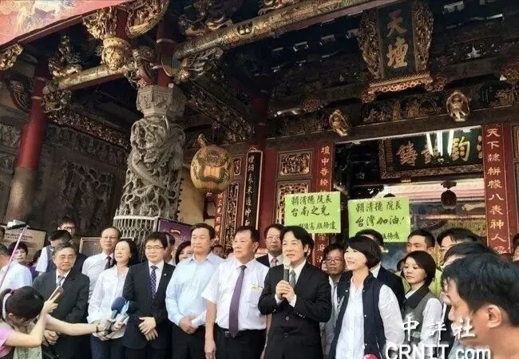
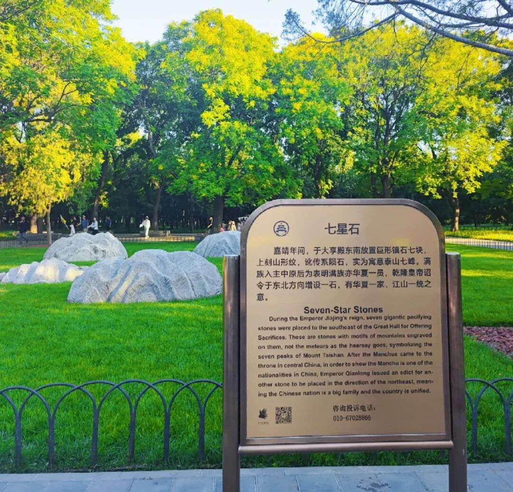

# 合则两利，来就是赢

> 来源: 太阳照常升起

> 发布时间: 2026-05-13

> 原文链接: https://mp.weixin.qq.com/s/W27JfHoS6bOyYu9Wa1ht7g

---

如果不能宣布赢，就不会让来。

如果不能宣布赢，就不来了。

这次来不敢吵架，时移而势易。

单赢是不可能的，只能是双赢。

就来两天，技术内容都谈差不多了，还在仁川机场做了确认，肯定有宣布赢的基础。剩下的分歧现场拍板。最终肯定还有分歧，但不影响可以宣布赢的那些部分。

**除了工作，还有生活，但生活其实也是工作。如果是同游天坛，似乎开创先例**。之前尼克松和福特参观过，但没有同游过。

《大明会典》最早规定了外国使节参观天坛的制度："特许其使臣同书状官及从人二三名，于**郊坛**及国子监游观，礼部劄委通事一员伴行，拨馆夫防护，以示优异云"。当时是对朝鲜使节的特殊优待。

**天坛是进行历史文化教育的好地方**。

比如，

**海峡对岸也有个“天坛”，郑成功收复台湾后在台南立的**。现在每年都还在祭拜，既拜天公，也拜郑成功。连数典忘祖的赖清德也不得不去祭拜。“天坛是台湾的信仰中心”，这话是赖清德说的。

又如，

乾隆下诏在**天坛“七星石”**的基础上增设一石，寓意“**华夏一家、江山一统**”。

**去春游怎么能白游呢？写读后感是必须的**。历史悠久就是好，时时处处都可以用来搞教育。回去以后，就可以宣布，“没人比我更懂天坛”了。

就是这两天有点热，都要34度了，老天爷也是，热情似火。

以上。

**既要工作，也要生活，欢迎加入作者的知识星球**！

---

*本文抓取时间: 2026-05-13 20:00:30*
