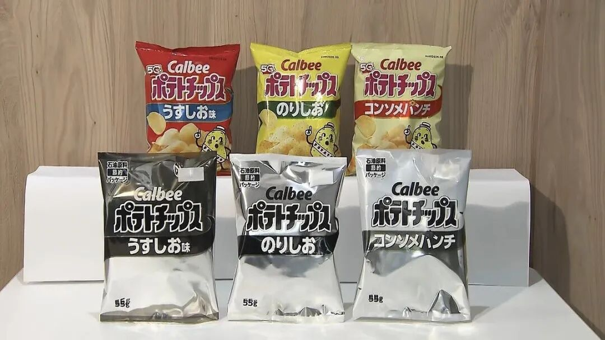
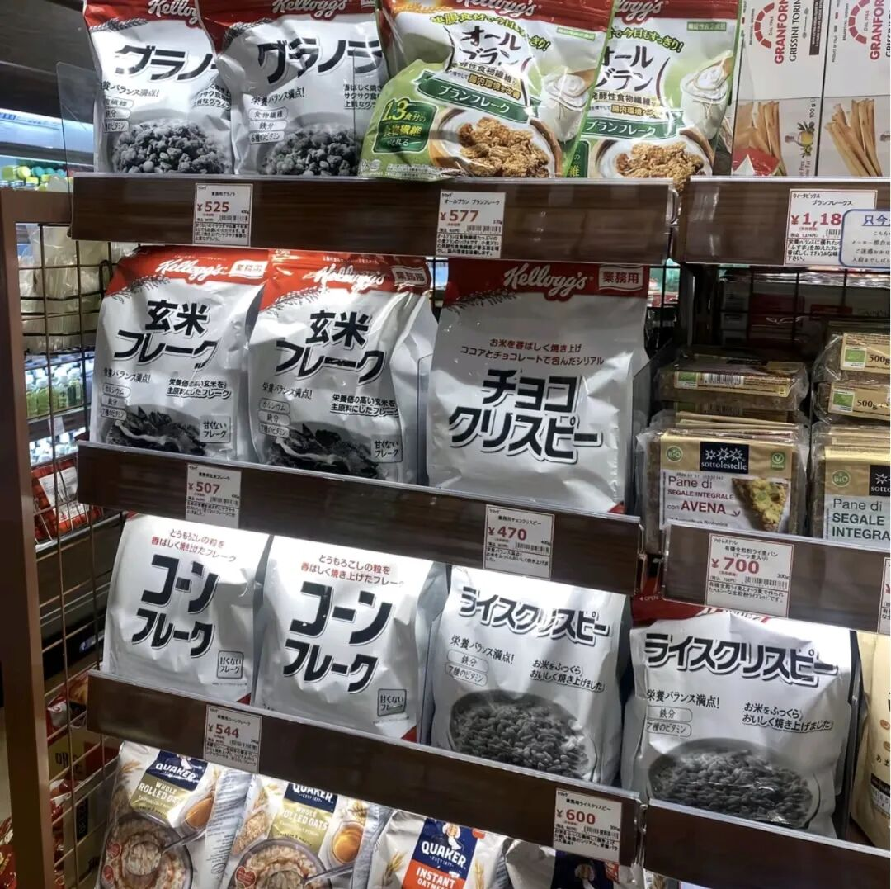
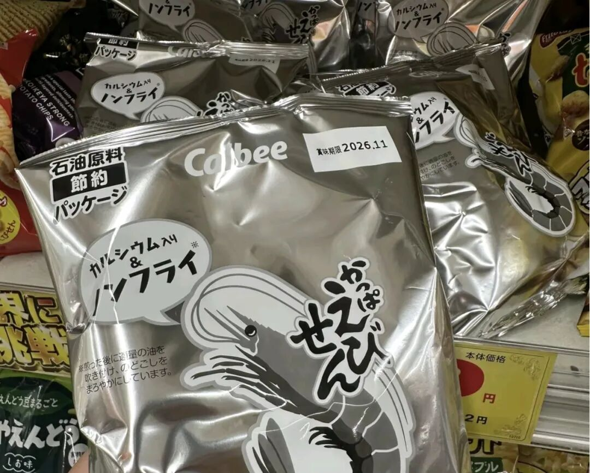

# 美伊怎么又打起来了？

> 来源: 太阳照常升起

> 发布时间: 2026-06-11

> 原文链接: https://mp.weixin.qq.com/s/r8rlE9sa-kJYZfZ07ewAqw

---

简单讲两句。

**1、两个核心问题还没达成一致**

一是浓缩铀如何处置，二是霍尔木兹海峡能否收费。两边到目前为止都是各自坚持。对伊朗来讲，这两个都是可以用来反制的核武器，是用生命换来的，不可能放弃。对川普来讲，到目前为止，放弃哪个，政治上都要背负巨大包袱。那就只能继续耗。

一个小看点，阿曼还在跟伊朗谈海峡管理权，鲁比奥威胁阿曼不许谈收费权，阿曼说我们只是在谈管理模式。言下之意，你们到时谈不拢，双方压力过大的时候，还得来找我阿曼，因为海峡两边只有伊朗与阿曼。伊朗在设计这套制度的时候已经考虑过《联合国海洋法公约》和习惯国际法问题了，所以选择了导航、搜救、海上保护等这样的名目，阿曼议员**穆罕默德·苏莱曼·塔米姆·欣奈**公开支持这些收费名目，但阿曼官方在美国同意前肯定是不敢公开讲同意的。

关于海峡收费这事，比的是各方耐力极限。一些航运巨头已经公开表示，与其拖下去，不如建立收费模式，其实成本比现在这样低得多。

所以阿曼选择了对自己最有利的策略，保持与伊朗谈判海峡管理模式，如果哪天川普忍不住同意了，那就顺其自然；如果最终不行，那随时终止就行。

关于阿曼的情况可以回溯阅读4月初的文章《[阿曼会与伊朗共同管理海峡吗？](https://mp.weixin.qq.com/s?__biz=MzI0ODE5NDU5Mw==&mid=2649551746&idx=1&sn=64fb8844efa9729984b7503c1466ee50&scene=21#wechat_redirect)》。

**2、会不会再次开战**？

大打伤身，小打怡情。再次开战，哪怕以军事行动的名义都不太可能了。但空袭、飞导弹是可以的。川普不想看到美军有任何伤亡，所以不会展开多少新的实质性行动。伊朗随时也会飞导弹，你飞我也飞，大家一起飞。

**3、为什么伊朗又宣布关闭海峡了**？

因为谈得不顺利，关键问题谈不拢，备忘录签不下来，川普着急。6月2日，伊朗有艘船（Lexie号）准备到哈尔克岛装油，美军战机发射地狱火导弹将其击瘫痪，6月8日、9日又分别击中两艘去伊朗运油的船，并且对格什姆岛和伊朗南部地区进行了空袭。伊朗选择反击，6月9日、10日，击落了美军一架阿帕奇直升机和一架MQ-9无人攻击机。还把美国在海湾的军事基地飞导弹炸了一圈。

美军违反暂时停火约定在先，伊朗宣布再次关闭海峡。与此同时，川普奚落说，美国每天都在提取石油，每晚数百万桶，所以油价才没涨，然后说伊朗刚发现。搞得美国能源部长在接受国会听证的时候非常被动。

川普其实是想说，在美军掩护下，一些油轮从霍尔木兹海峡驶出了，都是他的功劳。突然公开讲这个，是因为他知道，伊朗又要关闭海峡，所以未来一段时间，可能运不出那么多了，与其就这么关了，不如先给自己表表功。

伊朗说到做到，刚宣布关闭，就攻击了两艘准备驶出海峡的油轮。

**4、接下来会怎样**？

如果算经济账，由伊朗、阿曼共同管理海峡，哪怕由海湾国家参与共同形成管理方案，都是可选项。无非就是，伊朗受损这么多，被压制这么多年，得有补偿。川普是现实主义者，他是否同意完全看局势而定，欧洲完全就是白莲花，只能跟在川普屁股后面谈理想。

伊朗和美国都有极限。

伊朗的极限是如果长期没有石油收入，财政可能崩溃。之前讲伊朗石油运不出，石油生产系统会崩坏，一个月内就会投降的网友，如今纷纷不说话了。到底能忍几个月，你看伊朗态度就知道了，目前看，忍到年底美国中期选举多半是没问题。伊朗彻底垮了对不少国家不利，大家都会考虑自己的。

美国的极限是通胀对美股的影响，美国建国250周年纪念的脸面，以及中期选举。美国5月通胀率都4.2%了，要不试试加息，看看美股的反应？

所以美伊目前比的是耐力，谁都不愿意先低头。要伊朗放弃到手的鸭子，没可能；要川普低头其实不难，他非常务实，关键是外部舆论环境要发生变化，这样他低头的时候才不会腹背受敌。

当然还有可能就是耗到某个程度，再出个60天的短期停战备忘录，继续谈，继续拉扯。但伊朗不会像上次那样，因为油价不高，对川普没威胁，还是得解决问题。

所以，**川普采纳贝森特的策略是用时间耗尽伊朗财政，伊朗选择的策略是通过再次封锁海峡拉高油价来推升美国通胀最终打击美股**。

都是高材生，985毕业的。

**5、白莲花还在恍惚中**

油价维持高位，除了生活品通胀给民众带来的压力，还打击了欧洲和日本的燃油车产业，让中国的电动车加速进入各国市场。电动车这东西，开过都知道，只要试一次，就再不可能回到油车了，而且口碑传播会非常快。德国和日本的汽车产业代价非常大，最终可能影响欧盟和日本整个经济。但即便如此，德国和日本的政客还装做没事一样。

日本博主纷纷在网络上展示各种黑白塑料包装，因为缺海湾运来的石脑油，导致塑料包装都没有彩色了。

**知道的是因为没有石脑油，不知道的，还以为日本在举国办白喜事**。

即便如此，高市早苗还要继续跟中国强硬对抗，日本不只石脑油不够，稀土也快没了，美国竟然开始帮日本找中国要稀土，可能给吗？

日本跌倒，韩国吃饱。日本半导体翻身仗是彻底没戏了。

日元贬值是为了出口，但产品没有竞争力，出口怎么起得来？于是变成了光贬值，老百姓亏得一塌糊涂。在日本打工的中国人每个月都在短视频上算，这个月因为汇率又亏了多少，是不是该回老家了。

差不多就是这样。

以上。

**随手一写信息量都很大，欢迎加入作者的知识星球**！

---

*本文抓取时间: 2026-06-11 12:00:27*
