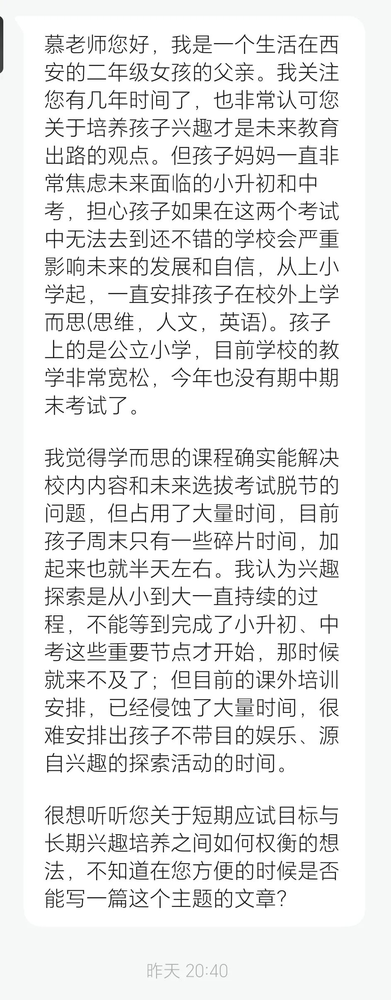

# 小学生如何培养兴趣

> 来源: 太阳照常升起

> 发布时间: 2026-06-17

> 原文链接: https://mp.weixin.qq.com/s/N2MM8O19qbRKkZKlsjzp1g

---

昨天一位老读者在后台发来了以下私信：

这位读者家长的问题非常有典型性，相信这几年带娃的绝大多数家庭都经历过这个阶段。小学校内教得太简单，应试培训太少，甚至学校留的作业都很少；小升初有点招、分班考，一到初中，就进入到严格的选拔模式，教培机构每天散布焦虑，告诉家长，起步晚，步步晚。这种情况已经持续好几年了。

作者不是教育专家，也没有培养出学霸儿童，作者相信，大多数青少年，都不是学霸，即便你在某个学校暂时领先了，按目前的选拔模式，到下一个阶段，很可能还会落后，这是掐尖的概率决定的。这就是KPI考核模式下的层层选拔、逐级掐尖。人们只看到最终“成功”的个别人，但大多数人，其实只是分母。

顶尖的教育学家和科学家反复说明这种选拔模式对青少年教育是不具有科学性的，但耐不住大环境如此。说到底，还是因为第二次婴儿潮带来的学籍人口高峰还要持续十几年。普高、本科扩招虽然加速，但只能维持一个相对稳定的入学比例。因为人口基数这个分母变大了，每年上不了一本、211、985的绝对人数，就会自然变得更多。

家长带小学生去试一试超过课内难度的数学教育，未尝不可，确实有极少数学生是有天赋的，如果恰好你的孩子是，他/她能够沉浸其中，很开心，那说明这就是他/她的兴趣。但如果试了试，发现兴趣不大，那所谓中高难度的“小奥”就毫无意义，因为除非你一直走奥赛选拔路线，其实小学阶段这方面的学习跟初中基本没有关系。如果所在小学确实教学不行，四年级之前抓抓基础，把课内掌握好就行了，四年级之后再开始尝试一些中等或中下难度的课外班，多半是不晚。

关键是学生觉得老师怎样，如果觉得好，能听进去，就有收获，如果学生觉得不行，听不进去，听了也是白听。如果本身就都开始抗拒了，那还是别听了。

英语如果没有家庭语言环境，那课外学习太早其实意义也不大。尤其是小学低年级，甚至幼儿园阶段，教培机构就强调双语开发，有几个被开发出来的呢？如果学生有语言天赋，自己喜欢，那可以顺其自然的加码。如果不喜欢，能把课内先搞扎实，等到小学高年级后再开始加码也不晚，这主要是为了对接初中的难度。

语文重要的是阅读和表达。多读书是最好的。怎么才能多读书？家长都给孩子规划好了，买了一大堆，那不叫兴趣，那叫任务。你就想，你被领导指定读三本书，你什么心态？所谓兴趣，就是开心，你让一个小朋友天天干不开心的事，有必要吗？怎么读书，自己选，不要家长指定。

学校和教培机构现在很多指定阅读书目，还教小学生如何阅读，一篇文章，全变成语文教学，说实话，有必要吗？如果每篇文章都让你总结段落大意，每本书都让你写读后感，你能活到今天？本来一件开开心心的事，全部变成应试模式，人能不疯吗？一点选择都不给孩子，你指望他/她能积极？

作者认为，**人生就是不断试错的过程。小学阶段就该开始了**。语文、数学、英语这些课外内容可以尝试，但不能只有这些内容。绘画呢？音乐呢？体育呢？甚至游戏呢？如果一个小学低年级学生，除了应试内容，其他活动都没有了，除非他/她恰好对语文、数学、英语有兴趣，那后面他/她大概率要难受几十年。因为那些真正有兴趣的学生，很容易在小学阶段就尝试到兴趣的好处，能够从内心真正体会到什么是“事半功倍”，什么是“擅长”，什么是“我很厉害”。甚至还有一些小朋友在小学阶段就能体会到兴趣活动产生的“心流”，这可能是很多东亚成年人终其一生都体会不到一次的。

但凡在小学阶段体会过兴趣带来的各种好处，即便这些学生在未来的课内主科选拔中不占特别的优势，不算成绩最好的那批学生，但他们的耐力、毅力、坚持的精神，尤其是对待人生的心态，都会远比其他学生要强很多。因为他们永远知道，自己擅长一件事，是怎样的感觉。

一些家长有种错误的认识，觉得兴趣就是放松、娱乐，讲到孩子的兴趣，就是玩游戏，看动漫。恰恰相反，**真正的兴趣并不是娱乐，而是沉浸其中能够带来的成就感，这种成就感不是跟别人比较出来的，而是真正从内心体会到的，这种兴趣在外人来看，甚至可能是辛苦的**。

许多家长喜欢带小朋友各种考证、考级，其实对升学没有任何帮助，还乐此不疲。很显然，这些家长自己就是牛马，因为他们当年找工作就是靠各种证书，总觉得证书多一点就有更用，其实对升学毫无用处。

作者知道，尽管教育部三令五申，但各地初中还是在靠一些“杯赛”、内部比赛，主要是奥数，搞小升初的掐尖。但其实，即便不上这些掐尖校，即便不上这些实验班，最后仍然有很多学生靠自己的学习获得很好的成绩。关键，这些学生也没浪费自己的时间，他们其他方面的兴趣爱好十分广泛。

掐尖出来的，是极少数，换句话，你家小朋友恰好数学有些天赋，正是符合当前掐尖标准的，自然也就得利。但对绝大多数家庭而言，其实都没有这个可能。**自己的孩子天赋在哪里，兴趣在哪里，做父母的，应该比其他人了解更多。如果这都不了解，非要按当前掐尖标准来逼孩子就范，那就是父母的失职**。

小学阶段，多让学生参加更多的活动，一项一项去试，把那些他/她明显擅长的，保留下来，鼓励坚持下来，让他/她体会到那种成功的喜悦，让他/她**顺道**取得一些成绩，而不是以考证为目的，那就非常好了。

小学低年级，多好的时光，周末不能多去旅游吗？不能多去见见世界吗？真到了初中，时间就很少了。小学阶段，学校教育太慢、太散，大环境改变不了，那适当增加一点内容，在平时完成就好了，周末全占完了，那身体能好吗？视力能好吗？

还是那句话，**多尝试，多让孩子去选择，而不是让教培机构替你选择**。家长负责提供一个尝试的环境，试出学生的兴趣，坚持下来。**当小学生都不开心，那这辈子还能开心吗？吃得苦中苦，一辈子吃苦**。

**家长少一些焦虑，你焦虑再多也没用**。问问身边有多少大学生、研究生都还没就业。问问多少研究生都中年失业了。想通这些就好。如果小朋友不喜欢，一开始他/她还小，不太会表达，你作为父母，只能自己去感受，如果你感受不到，等他/她再大一些，就会反弹，也有不反弹的，直接抑郁了。我们一些大城市中小学生的调查抑郁率已经超过30%了，到时你想的就不是小初升、中考、高考，你想的就是，活着就好。

当然，还有一个问题，作者也是这些年亲身感受到的。课本教育、社会现实和学生兴趣脱节得非常厉害。课本在讲传统知识，顶多举了一些看似新鲜的例子，选拔考试呢，与课本可能完全脱节；社会现实呢，是学生每天耳闻目睹的；兴趣呢，似乎与上述都无关。这种三方脱节的问题，造成了时间的大量浪费。

了解现实、读课外有意思的书，似乎就是在“浪费”学习时间；只要是在“学习”，似乎就与现实和兴趣不相容。这种情况，对很多学生而言，一直要持续到高考结束。

高考结束，选专业，发现学了12年，除了考试，除了知道有文科、理科、工科，连大学有哪些专业都不知道，连每个专业对应的就业是什么都不知道，每个就业有哪些好的头部企业都不知道，每个企业能挣多少钱，更不知道。于是，都去考公，当公务员旱涝保收，这个事，大家都知道。

**为什么不能让中小学生直接了解现实呢？直接了解我们的产业呢？直接了解他们日常就在接触的各种新鲜信息，让他们从小就体会到，自己的学习，其实都跟他们最感兴趣的事物，那些最酷的事，是相关的呢**？

游戏难道不是一个好产业吗？旅游难道不是一个好产业吗？二次元、国漫难道不是一个好产业吗？航空航天、玩具、体育用品乃至潮玩，哪个产业不是好产业呢？这些产业里难道就没有文学？没有数学？没有英语？没有物理？没有化学？

为什么我们的课内学习总是无法与我们的现实结合起来，为什么到学生高考结束的时候还不知道自己该学什么？为什么学完了都不知道去哪里就业？为什么那么多优秀的学生，学了一辈子，也就是找个地方挣工资当牛马，中年失业后连基本的生存能力都丧失了？

教育出了问题，基础教育与现实脱节太久了，但现在的考试又很喜欢与现实结合起来。甚至许多高校与现实都是脱节的。所有的教育都是为了选拔，都是站在大人的角度选未来的小牛马，都没有考虑过学生的需求，都没有想过一个小朋友的兴趣和思维是怎样形成的。

我们光讲培养，如何培养？做题，考试，逼着读指定的课外书，去考各种证，这就是全部的培养？

过度理想化是没有意义的，但在现有条件下，尽可能地去改善，是有很大空间的。认可高考指挥棒，认可应试选拔的公平性，这是一切的前提。在这个基础上，将基础教育与经济社会现实紧密结合起来，让学生在学习的过程中能直接感受到产业、经济、法律、国际环境，甚至地缘政治，都完全是有可能的。

**能不能有效解决这个问题？让学生将应试选拔尽可能地与兴趣培养、现实认知结合起来？作者已经开始在做一些尝试**。

这是一个全新的领域，作者将亲身投入，争取在不久的未来，通过一个新的平台，展现给大家。

以上。

**改变从点滴做起，欢迎加入作者的知识星球**！

---

*本文抓取时间: 2026-06-19 10:30:39*
