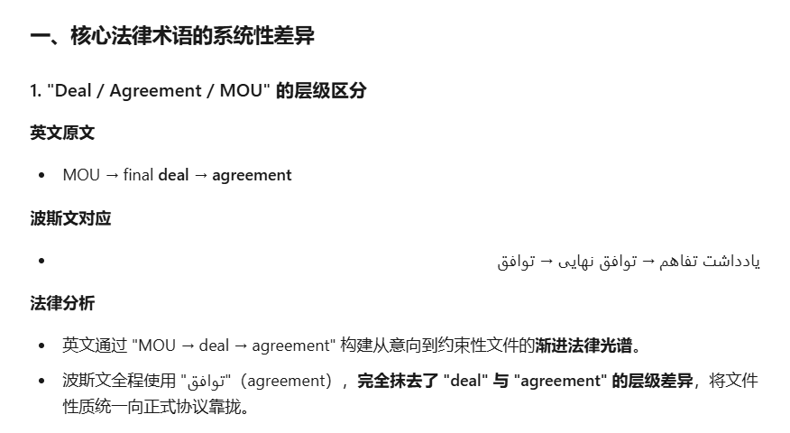
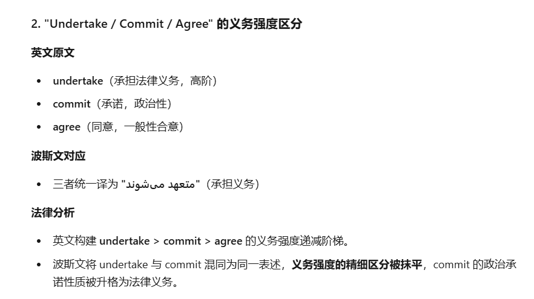
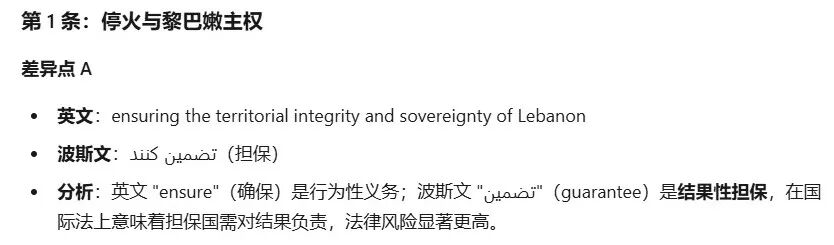
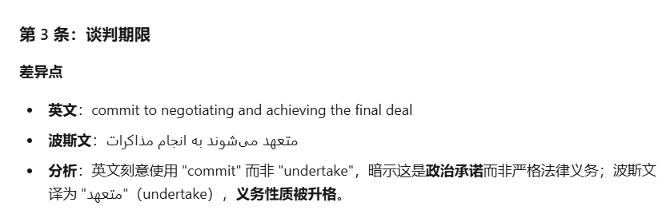
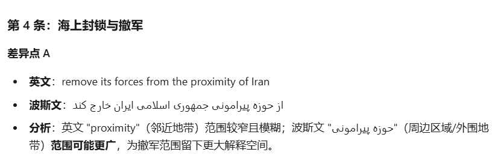
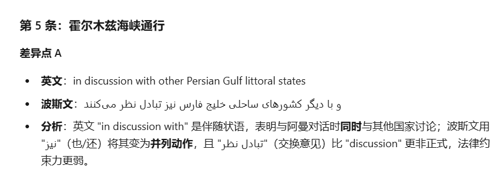
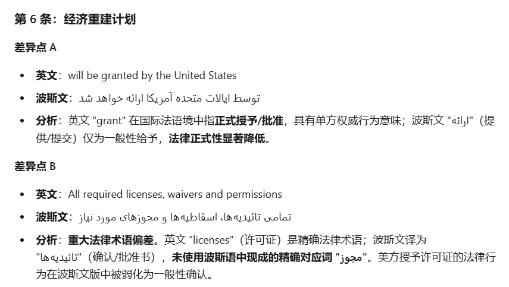
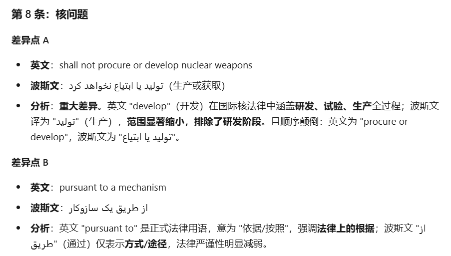
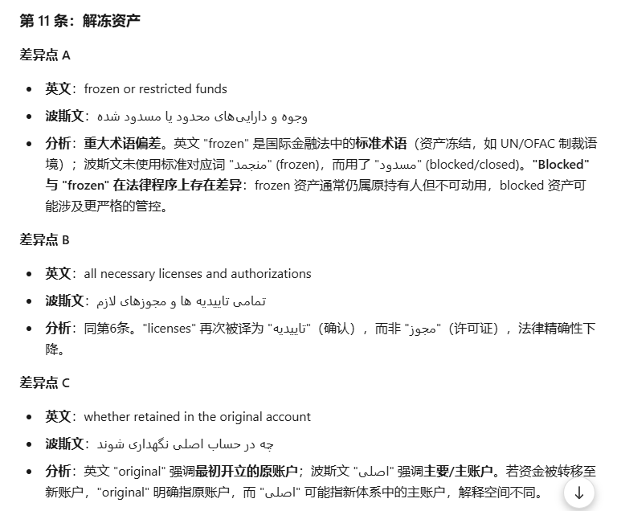

# 美伊备忘录双语版本的主要差异

> 来源: 太阳照常升起

> 发布时间: 2026-06-18

> 原文链接: https://mp.weixin.qq.com/s/qzN9QQ9tpP0K9Fxg1mjSOQ

---

众所周知，两国之间的法律文件通常都会双语签署，并且约定具有同等法律效力。美伊备忘录也有英文和波斯文两个版本。

但同样众所周知，双语或多语版本的国际法律文件，由于存在语言差异，很多时候，签署方也会动一点小脑筋，做一点小手脚，存在细微差别。这些细微差别，给各自解释，留下了空间。

一方面，存在这些细微差别，有利于说服本国的反对者，尽可能先达成一份法律文件；另一方面，由于存在细微差别，各自解释不同，也为此后的操作，留下了可能的争议和困难。

当然，能够先签一份，肯定比一直不签要好。

所以，此时去看美伊备忘录的英文版是不够的，看中英对照就更没意义了，**得看英文与波斯文对照版才有意义**。

但有几个人中国人能读懂波斯文？

这就是AI在今天很有意义的地方。**作者用AI将美伊备忘录的英文与波斯文版本进行了逐条、逐句、逐字的对照分析（内容仅供参考）**。

**首先，是从全文视角，发现了几个关键法律术语在两个版本中的差异**

**其次，部分条款的关键词汇存在显著差异**

1、The United States of America and the Islamic Republic of Iran and their allies in the current war are signing this MOU to declare the immediate and permanent termination of military operations on all fronts, including in Lebanon, and undertake from now on not to initiate any war or any military operation against each other, and to refrain from the threat or use of force against each other, and **ensuring the territorial integrity and sovereignty of Lebanon**. The final deal will confirm the permanent termination of the war on all fronts, including in Lebanon and other provisions of this paragraph.

3、The United States of America and the Islamic Republic of Iran **commit to negotiating and achieving the final deal** in maximum 60 days, extendable with mutual consent.

4、Immediately upon the signing of this MOU, the United States of America will begin the removal of its naval blockade and any disturbances or impediments against the Islamic Republic of Iran, and will fully end the naval blockade within 30 days. During this period, the traffic of vessels will be in proportion to the numbers of pre-war traffic being restored by the Islamic Republic of Iran. The United States of America further undertakes to**remove its forces from the proximity of the Islamic Republic of Iran** within 30 days after the final deal.

5、Upon the signing of this MOU, the Islamic Republic of Iran will make arrangements using its best efforts for the safe passage of commercial vessels with no charge, for 60 days only, from the Persian Gulf to the Sea of Oman and vice versa. The traffic of commercial vessels will immediately start, and considering the need for removing the technical and military obstacles, and demining by the Islamic Republic of Iran will be instated within 30 days. The Islamic Republic of Iran will conduct dialog with the Sultanate of Oman to define the future administration and maritime services in the Strait of Hormuz **in discussion with other Persian Gulf littoral states** in line with the applicable international law and the sovereign rights of coastal states of the Strait of Hormuz.

6、The United States of America undertakes with regional partners to develop a definitive, mutually agreed plan with at least USD 300 billion for the reconstruction and economic development of the Islamic Republic of Iran. The mechanism for the implementation of this plan will be finalized as part of a final deal within 60 days. **All required licenses, waivers and permissions needed for the relevant financial transactions** **will be granted by the United States of America**.

8、The Islamic Republic of Iran reaffirms that it **shall not procure or develop nuclear weapons**. The United States of America and the Islamic Republic of Iran have agreed to resolve the disposition of stockpiled enriched material **pursuant to a mechanism** that will be mutually agreed upon in accordance with the schedule mentioned in paragraph seven, with the minimum methodology to be down blended on site under the supervision of the IAEA. The two parties also agreed to discuss the issue of enrichment and other mutually agreed matters related to the Islamic Republic of Iran’s nuclear needs, based on a satisfactory framework being agreed upon in the final deal. The final deal will confirm the provisions of this paragraph. The United States of America and the Islamic Republic of Iran acknowledge the critical importance of the nuclear issues above mentioned. They express their intention to immediately address these issues in the negotiations in order to achieve mutual agreement on them.

11、The United States of America undertakes to make fully available for use the **frozen or restricted funds and assets**of the Islamic Republic of Iran upon the implementation of this MOU. The United States of America and the Islamic Republic of Iran will mutually agree on the procedures related to the release of these funds during negotiations. Such funds, **whether retained in the original account** or transferred, shall be made fully usable for payment to any ultimate beneficiary designated by the Central Bank of the Islamic Republic of Iran. The United States of America undertakes to issue **all necessary licenses and authorizations accordingly**.

上述对比分析，作者是用kimi结合作者此前的skill做出，有兴趣的读者，也可以用其他AI试试。

可以看出来，美伊各自小心思还是不少的。

由于MOU虽是法律文件，但不具有强制约束力，所以后续60日的谈判还会存在诸多困难，最终能谈出什么结果，还不好讲。美伊双方内部的反对者都不少，以色列这样的外部搅局者还会继续发力。

中东的和平，从来都很难取得。

但有总比没有好，MOU的签署，本身就是代表双方执政者的基本态度。

以上。

**活用AI，欢迎加入作者的知识星球**！

---

*本文抓取时间: 2026-06-19 10:30:50*
