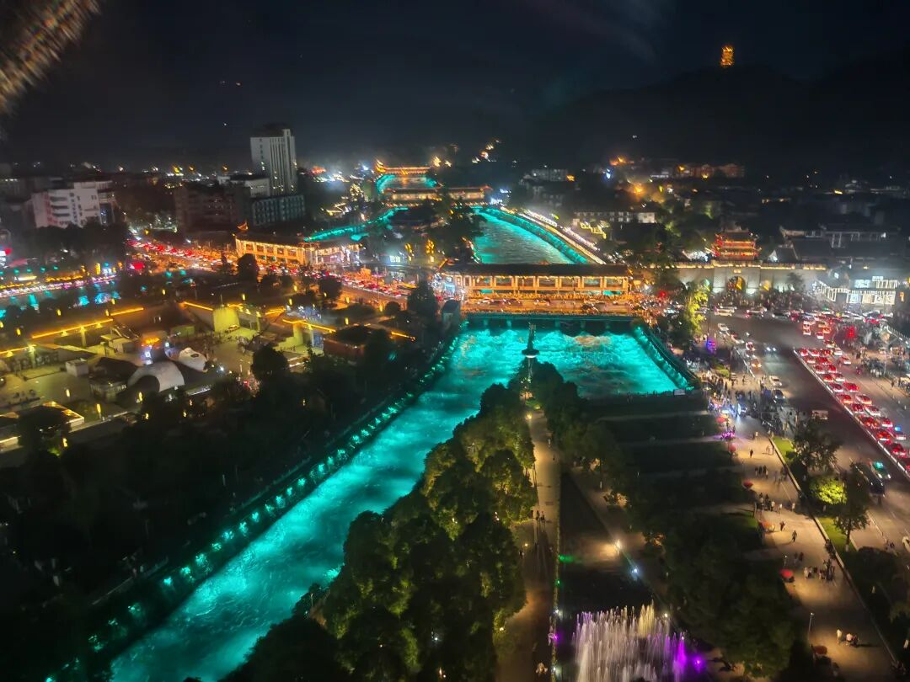

# 矛盾的感受

> 来源: 太阳照常升起

> 发布时间: 2026-06-19

> 原文链接: https://mp.weixin.qq.com/s/6VVAbUOLaD5A-3dpWavzgQ

---

端午节在都江堰。

白天去灌县古城，人不多。南桥旁边江边的饭馆，算是地理位置最好的用餐地点之一，午餐时间竟然没有几桌。一看用餐意愿不是太强，老板还主动打了折。还说现在生意不好，一年不如一年。

这种说法，现在很多。走到哪里，都有类似的表达。本以为现在旅游真也不太好了，直到等到晚上。

依然人山人海。

挤不过年轻人、旅游众。

所以，到底真实情况是什么呢？

老登、小登的心理差异，无处不在。

说是小登赚钱，问题是，赚钱的真是小登吗？还是一小撮各种登呢？

以上。

**汇集各种登，欢迎加入作者的知识星球**！

---

*本文抓取时间: 2026-06-19 22:00:26*
