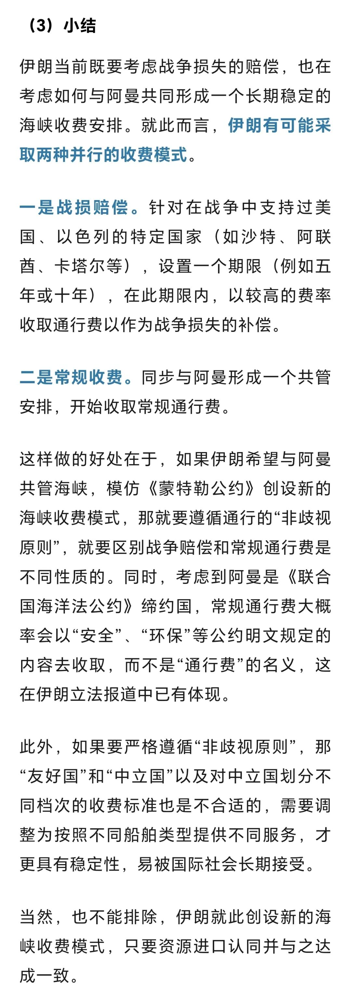

# 阿曼首次对霍尔木兹海峡收费表态

> 来源: 太阳照常升起

> 发布时间: 2026-06-24

> 原文链接: https://mp.weixin.qq.com/s/vF-DSL4CKE0LMjOC4za8dg

---

作者在4月3日讨论过阿曼与伊朗共管霍尔木兹海峡并收费的可能（《[阿曼会与伊朗共同管理海峡吗？](https://mp.weixin.qq.com/s?__biz=MzI0ODE5NDU5Mw==&mid=2649551746&idx=1&sn=64fb8844efa9729984b7503c1466ee50&scene=21#wechat_redirect)》）。当时认为伊朗将战败的声音还很大，阿曼也一直未就共管海峡公开表态。甚至到美伊签署备忘录，阿曼也没有表态。

此前国内多方认为霍尔木兹海峡收费违反《联合国海洋法公约》和习惯国际法，不具有可行性。作者在4月6日专门写了一篇文章讲阿曼和伊朗共管海峡收费如何实现（《[霍尔木兹海峡可能的收费模式](https://mp.weixin.qq.com/s?__biz=MzI0ODE5NDU5Mw==&mid=2649551776&idx=1&sn=80070c1fe921e9c43c5579461c2757b0&payreadticket=HHY49o5AJR6CldE5XGO5Pj18pg_1oVsyH52Mgu8NYAP6EJHIirGwyRZvQBAtupUquTt-bfk&scene=21#wechat_redirect)》），实际伊朗就是找到《联合国海洋法公约》的“收费权漏洞”，不以通行费，而以安全服务、环保等名义即可。（以下为4月6日文章相关内容）

**昨日（6月 23日），阿曼外交部发布了阿曼与伊朗的联合声明**，明确：

“伊朗伊斯兰共和国和阿曼作为霍尔木兹海峡的沿岸国，重申其根据适用国际法保障海峡安全通行的承诺，同时强调两国在霍尔木兹海峡领海上的主权和主权权利。双方根据《伊斯兰堡谅解备忘录》的条款，讨论了与霍尔木兹海峡相关的事项。

“双方同意通过两国外交部之间的联合工作组就此事保持对话，以就霍尔木兹海峡未来航行管理、**将提供的相关服务以及与之相关的费用达成协议**，该协议须符合国际标准。在此框架下，双方还同意与该地区沿岸国及任何其他相关方举行讨论。”

**此前所有关于阿伊共管海峡并收费的公开信息均由伊朗发布，这是首次由阿曼发布，相当于正式承认了未来共管海峡并收费的多边安排已经在实质性推进，大概率要成为现实**。

阿曼作为美国、海湾国家与伊朗之间的长期协调国，主动表态，意味着这项安排其实已经得到了美国与海湾国家的默认。

如果霍尔木兹海峡共管收费最终成为现实，也为天然海峡管理创造了一个先例。

关于霍尔木兹海峡共管收费这个问题，作者已经发表的文章包括：

3月30日《[伊朗海峡收费权对石油美元的结构性冲击](https://mp.weixin.qq.com/s?__biz=MzI0ODE5NDU5Mw==&mid=2649551706&idx=1&sn=4d39ecd9956c63bda949688808503041&payreadticket=HDNQNhpkEFwJHRhvOpeUmI4b57fRTu_33xLEAelo2YP33pxmf3B6Qo2bHaqG81NZPwAVQhQ&scene=21#wechat_redirect)》

3月30日《[伊朗收取海峡通行费是否违反国际法？](https://mp.weixin.qq.com/s?__biz=MzI0ODE5NDU5Mw==&mid=2649551711&idx=1&sn=22b9b65a44218e9ddc5e1aeac7e88321&scene=21#wechat_redirect)》

3月31日《[没有硝烟的战场——伊朗关于海峡收费权的博弈](https://mp.weixin.qq.com/s?__biz=MzI0ODE5NDU5Mw==&mid=2649551715&idx=1&sn=5d6ab1a3da817a5543dca66a8896f1e1&payreadticket=HDkSQzrB59mi7-_KnxJvaSzmXtLAIEFwq-d3Dr0fkcuewvyBfL80BKxeVQI2f-7SYSzApsQ&scene=21#wechat_redirect)》

3月31日《[“财新”关于伊朗收取海峡通行费违反国际法的观点是不对的](https://mp.weixin.qq.com/s?__biz=MzI0ODE5NDU5Mw==&mid=2649551719&idx=1&sn=77fabfdc94d2d6c94ad361010bf552cb&scene=21#wechat_redirect)》

4月3日《[阿曼会与伊朗共同管理海峡吗？](https://mp.weixin.qq.com/s?__biz=MzI0ODE5NDU5Mw==&mid=2649551746&idx=1&sn=64fb8844efa9729984b7503c1466ee50&scene=21#wechat_redirect)》

4月6日《[霍尔木兹海峡可能的收费模式](https://mp.weixin.qq.com/s?__biz=MzI0ODE5NDU5Mw==&mid=2649551776&idx=1&sn=80070c1fe921e9c43c5579461c2757b0&payreadticket=HLh4hs0rJLYZzkAT4maLMn7QMbK-aLr5KXfWGBmksG7f3tW8sOymbFIvzGSXHNDIiJaNlBw&scene=21#wechat_redirect)》

各位读者随作者共同见证了整个过程。

以上。

**时间是最好的验证工具，欢迎加入作者的知识星球**！

---

*本文抓取时间: 2026-06-25 22:30:30*
