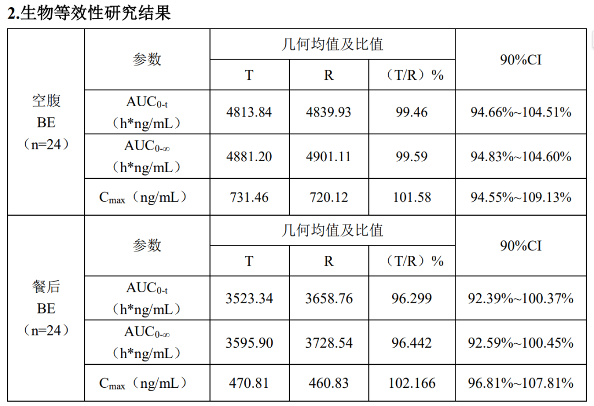
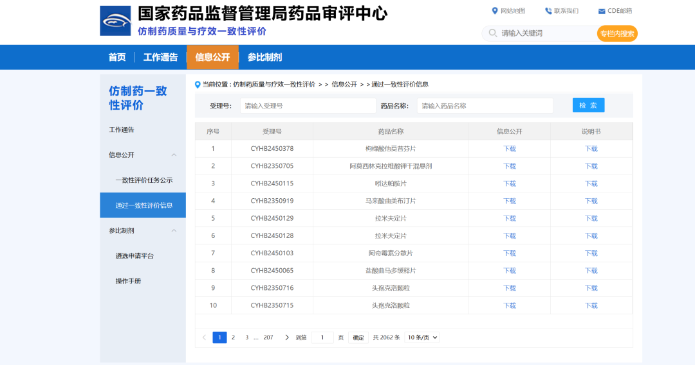

# 如何选择国产仿制药

> 来源: 太阳照常升起

> 发布时间: 2026-06-27

> 原文链接: https://mp.weixin.qq.com/s/isbvJhHOUyDQgeVCgNiR5A

---

昨天《[部分国产仿制药质量堪忧](https://mp.weixin.qq.com/s?__biz=MzI0ODE5NDU5Mw==&mid=2649552262&idx=1&sn=5c604810ad63d3e07e62972be6533381&scene=21#wechat_redirect)》一文阅读量大，讨论也多，有不少还是医药行业的读者在留言。

作者昨天的观点是，中国应该向欧美的仿制药披露规则进行学习，让市场说话。今天进一步了解欧美相关制度后，作者发现自己昨天的观点存在问题，也就是中国大陆当前关于仿制药生物等效性（BE）的数据披露要求其实是比欧美都要激进的。也就是从规则上讲，中国大陆仿制药披露的数据要显著多于欧美先发国家。

基于上述，作者进一步从患者视角考虑，对于有仿制药需求的普通家庭，如何在现有条件下，尽可能去选择靠谱的仿制药。

本文就是基于上述目的而写，在这个过程中，作者也会简单介绍一下中欧美关于仿制药数据披露规则的相关差异，以及为何中国大陆虽然数据披露要求更多，但实际效果并不好。在此基础上，作者再从患者角度提出一些可行的选择方案。

对于一提到仿制药就声称“你没钱，你不配吃原研药”的杠精，如果这个话题下还不闭嘴，直接拉黑。作者不缺原研药，但这不代表，中国大陆大多数家庭都有商业保险能够长期负担原研药，并且，如果所有医院只能开仿制药，那即便能够负担原研药的人，其实也吃了亏，因为交了医保却无法享受，那以后谁还交医保呢？

仿制药互害，劣币驱逐良币，其实对所有人都是输，甚至连寻租都不可能持久。还有一些根本不在体制内的人，总认为“干部”就能从医院开到原研药，仿制药是专门给老百姓的。你去医院公众号注册一下，直接选“公费”，然后去医院，看看能不能给你开出原研药。难道你认为公务员去医院开药需要出示工作证吗？

仿制药问题是绝大多数人都要面临的问题。

作者通过本文，分享一下这两天查询了解到的一些情况。**本文可能会涉及个别专业词汇，不用紧张，看不懂就接着往下看，都有通俗解释**。专业人士可以留言进一步提供专业分析和建议。专业杠精闭嘴，反正你对老百姓除了提供负面情绪，也没什么存在价值。

**一、仿制药与原研药对比主要看什么**

主要就是看生物等效性（Bioequivalence, BE）评价。无论欧盟、美国还是中国大陆，绝大多数仿制药的**BE置信区间都设置在80%-125%**，也就是要求主要药代动力学参数（如**AUC和Cmax**）的几何均值比的90%置信区间落在 **80.00% - 125.00%** 范围内。

**AUC**代表了药物进入血液循环的**总暴露量**。它主要反映药物的**吸收程度**，即到底有多少药被身体真正吸收了。

**Cmax**指用药后血液中能达到的**最高药物浓度**。它主要反映药物的**吸收速度**——浓度越高，药效通常来得越快。

上述概念大概了解就行了，其实最终就是看一张表：

**作为患者，只看上述最右侧那列“90%CI”就行了**。这个数值在80%-125%之间才可能通过BE评价，获得那个“仿制药一致性评价”的小蓝标。理论上，这个数值区间越小，越接近于100%，就越接近于原研药。当然注意这是理论，但由于只有这个数值是可以用来讨论的，所以不用杠。

**上述表格是中国国家药监局评审中心（CDE）公布的，这已经是全球仿制药数据披露的天花板了**。因为无论欧洲EMA还是美国FDA，都不会披露具体的BE值。

那为什么欧美的监管机构都不披露？主要是为保护药厂的商业利益。因为BE数据包含处方工艺、溶出方法等核心竞争信息，如果广泛披露，可能挫伤药厂商业积极性，因此从立法上，就当做商业秘密保护起来了。

**二、为什么中国大陆仿制药数据披露最多，反而问题比欧美多**？

因为数据本身的问题。

中国公开的是经过企业整理后的"结果 PDF"，可追溯的原始色谱图、审计追踪等过程并不公开。CDE披露的BE数据，需要四个机构参与才能生成。

**一是药厂，二是临床研究机构（通常是医院），三是数据统计分析机构，四是生物样本检测机构**。

**请各位读者注意，如果上述四个机构都是比较靠谱的，那BE值的真实性越有保障**。如果上述四个机构中有部分不靠谱，那BE值的真实性就会出问题。去年闹得很厉害的，1988份BE报告数据重复事件，就存在这个问题。

不管监管机构是如何去补救的以及补救结果如何，作为患者而言，找到自己的常用药，去“**国家药监局药品评审中心仿制药与疗效一致性评价**”网站上，查询到自己使用的仿制药，去下载信息公开文件，就可以看到上述所有信息。CDE网站的页面是这样的：

最简单的搜索办法是在“受理号”中输入对应的仿制药编号，这个编号怎么查呢？很简单。你把药厂和药的名字输入AI，然后问这个款药的药物一致性CYHB编号，就可以获得。

下载信息公开文件后，就可以看到BE值和四个机构的名称。临床研究机构也就是医院是否靠谱，比较容易判断，最好是全国知名的三甲医院。后面两类机构，你可以通过AI去判断是否靠谱，最好是知名上市公司。也可以反向查询，近三年是否存在医监局的行政处罚等，来综合判断。

**三、还有其他办法吗**？

还有一个办法，由于欧美尤其是美国FDA的仿制药管理比较完善，执法极其严格，因此如果中国大陆某个仿制药获得了FDA认证并在美国上市销售，或者获得了欧洲EMA认证并在欧洲上市销售，且中国本土的生产线与出口欧美的生产线是同样的生产线（欧美共线），那其实比拿到小蓝标更靠谱。

那如何查询呢？说起来够复杂，你不如直接问AI，你服用的某款仿制药，是否获得FDA或者EMA认证，这样就能简单获得答案。

当然，这是有时效性的，查询的回答可能是数年前的，认证也是有期限的，你如果需要更准确的回答，还得追问，当前的情况。如果AI不能直接回答，那你得去FDA或者EMA的网站上去查询了。

**四、欧美监管是怎么做的**？

中国大陆目前的仿制药评价机制肯定是比以前什么都没有要强。但现实地看，不是披露更多数据就更好。一是数据本身是否靠谱，二是数据造假后有无严厉的处罚？

中国大陆长期都是倾向供给侧的，一家企业在当地就意味着就业、税收，地方保护一定存在。但问题在于，如果长期保护这种企业，最终只能是大家一起输。

大家都知道美国FDA监管是非常狠的。虽然FDA保护药厂的商业利益，不披露仿制药的BE值，但FDA做到了以下几点：

**1、批准前现场核查**

FDA 对仿制药的审评不仅依赖企业提交的电子数据，更关键的是**批准前必须进行现场核查（**PAI）。FDA审查员会亲临BE试验机构、CRO实验室和生产工厂，检查原始色谱图、审计追踪（Audit Trail）是否完整，BE 批与商业化生产批的处方工艺是否一致，以及其他数据完整性。

FDA年报披露，其在2024年共完成 **972 次药品质量检查**，同比增长 27%，其中 **60% 以上在海外（**印度、中国等 API 和制剂生产地）。

**2、极其严厉的执法**

FDA 的 483 表格和警告信是公开记录，企业一旦上榜，面临进口禁令、和解判决（Consent Decree，动辄数亿美元）、刑事起诉等严重后果。

**3、给予仿制药以市场激励**

光处罚，没有市场激励，没有钱赚，权利、义务不对等，不可能有好的结果。根据美国 Hatch-Waxman 法案，首个挑战专利成功的仿制药企业可获得**180天市场独占期，首仿药可按原研药80%售价定价。180天之后，独占期结束，仿制药就进入完全的市场竞争，价格降至平均为原研药的1/15。当然这里的原研药定价是美国本土的定价，同一原研药在不同国家的价格是不同的**。

**五、中国可以改进的方面**

**1、学习FDA批准前的强制现场检查**。当然，更关键的，是BE报告的药品与实际生产的药品存在差异，因此事中随时抽检是必须要加强的。

**2、强制信息披露，如果能够保证真实性，继续做下去比不做好**。欧美原研药多，因此对药厂的保护多，中国大陆需要大量仿制药，因此对大规模使用的常用药品，强制信息披露并不会太影响药厂利益。关键对虚拟披露的药厂要严厉执法。

**3、先有胡萝卜再有大棒**。胡萝卜就是继续优化集采制度。利用天量人口大市场搞集采不是问题，问题是不给企业足够的利益。极度的内卷最终是所有人都输。**集采定价可以综合考虑几个方面：**

**一是中国本土生产线与欧美共线的可能性**。如果集采价格能够支持共线生产，那对药企的激励会非常大，这样一条生产线，可以用来出口欧美挣更多，同时又满足本土的需求。一些常用药在欧美的售价其实已经非常低了，甚至原研药的价格在中国大陆都很低，患者完全是可以承担的，一片才两三毛钱的药，再去把价格打到几分钱，除了鼓励生产劣质药，其实没有任何意义。集采的意义在把高价药价格降到合理区间，而不是把低价药降到几乎为零。

**二是要在本土形成仿制药与原研药共存的局面**。集采的目标应该是让原研药把价格也降下来，这样形成共生、共同竞争。如果仿制药价格已经低到质量都无法保障，原研药就开心死了，因为老百姓最终自费也会去买，而仿制药厂最终只有死路一条。当然还有一种可能，就是原研药完全退出中国大陆市场，那仿制药就可以各种劣质互害了。这显然都不是集采的初衷。

**三是要综合集采和市场的力量去扶持高质量的仿制药**。目标应当是出现高质量的仿制药，并且让高质量仿制药去尽可能获得更多的市场份额，这样全社会医药综合支出才会降至最优。不能因为医保压力大，就接受各种低质低效的仿制药，这样看起来医保压力短期是减轻了，但老百姓的医疗支出压力其实是加大了，因为当老百姓对仿制药产生整体不信任的时候，就会改为自费原研药，其实是压抑了其他消费的可能，甚至连医保支付意愿都会下降。高质量、价格合适的仿制药，欧美可以实现，中国大陆当然也可以实现。关键是哪些仿制药更好，要能被识别出来，让市场说话，优胜劣汰，这样即便是自费，其实也降低了老百姓的负担。

给了胡萝卜，当然必须有大棒。如果上传虚假数据、生产与BE报告不符的药品、抽检不合格，都不能像FDA那样严厉处罚，永远是保护地方企业的供给侧思路，丝毫不顾及需求侧的感受，把实际花钱的人不放在心上，那最终的结局，必然是各种低质低价的生产过剩，整个产业不会好起来了。

绝大部分常用药的仿制药都不是GPU，更不是光刻机，中国医药企业的研发制造能力应付起来绰绰有余。希望整个医药行业不要成为另一个国足。

以上。

**遇到问题就穷根究底，欢迎加入作者的知识星球**！

---

*本文抓取时间: 2026-06-27 19:30:28*
