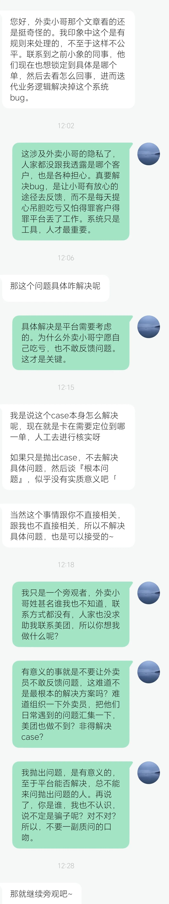

# 平台可以为外卖员做点什么

> 来源: 太阳照常升起

> 发布时间: 2026-07-01

> 原文链接: https://mp.weixin.qq.com/s/eFhnaCk5CsuhpFEdu7lK6g

---

昨天写《[外卖小哥的诉苦](https://mp.weixin.qq.com/s?__biz=MzI0ODE5NDU5Mw==&mid=2649552283&idx=1&sn=c312c259a6b92e1cc0cbc77fbd3f7416&scene=21#wechat_redirect)》，刚才后台有位读者私信联系，有了如下对话：

看起来像是美团的员工，但没有表明身份，所以不能确认。

看起来是想解决问题，但从表述来看，只是想解决具体问题。

作者订单里当然能看到是哪位外卖员，但作者不能向一个陌生人透露，即便是美团员工，作者也不能透露，原因有三：

1、外卖小哥没有向作者授权，或者寻求帮助，允许作者代表他做任何沟通。

2、作者不知道透露后，会发生什么，最终会是解决系统问题，还是解决别的。

3、作者认为解决问题的方式很多，根本不需要通过作者查询这位外卖员。

核心问题是，外卖员遇到客户刁难的时候，没有办法获得公平公正的对待。就这个问题，美团以及其他平台，完全可以定期组织外卖员集中反馈问题。你把人家当员工，平等地对待，人家才愿意讲真话。

从昨天文章的留言来看，有些做过美团外卖员的读者认为，可能是新手不了解规则；但也有其他读者反驳。内容很丰富，美团员工可以查看。

但在作者这里查看，也不如建立机制，定期收集外卖员反馈来得重要。

作为一家大企业，内部管理的事，总不能期待消费者来帮你解决吧。

多说一句，每天后台都有各种留言，跟作者讲各种事。如果自我介绍充分，确实有沟通的内容，作者基本都会回应。如果没有任何自我介绍，表达很充分，作者也会回应。但如果言辞让人不舒服，又不敢讲自己到底是谁，那作者肯定只能先预期对方别有用心了。

毕竟，作者后台的奇葩太多了。

彼此理解吧。

以上。

**今天本来想写其他的，但不影响继续关注作者的知识星球**！

---

*本文抓取时间: 2026-07-05 17:30:31*
