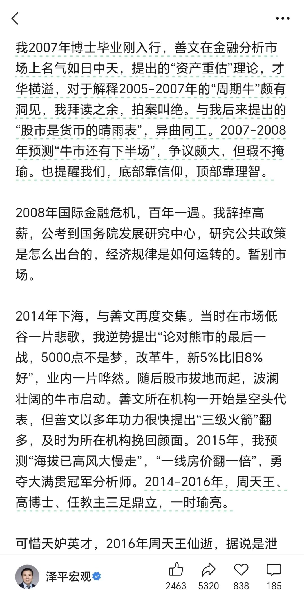

# 三足鼎立，一时瑜亮，四世三公，吓汝一跳

> 来源: 太阳照常升起

> 发布时间: 2026-07-08

> 原文链接: https://mp.weixin.qq.com/s/kSPu-PxmdIraDwB1L9KgFw

---

都说自媒体没有底线，但真正没有底线的人，其实也很难猜测他的上限。

刚看到这段，本来还有点犯困，立马被“三足鼎立、一时瑜亮”笑醒了。

每天找热点给自己脸上贴金就算了，还要消费逝者。

关键跟逝者毛关系没有。

高善文每个时期都在表达自己的观点，他的观点自成体系，并且很多时候他本来不需要讲，但出于本心，还是讲了，哪怕知道讲了会对自己不利。这就是为什么很多人还是佩服他。佩服不一定是每个具体的论断，而是一个人敢于抗住压力，公开表达自己的本心。

至于某位自封的野生教主，当年什么水平，人尽皆知，不得已才干起了网红买卖，到底是“三足鼎立、一时瑜亮”，还是“**四世三公，百姓所归**”，抑或是“**说出吾名，吓汝一跳**”，想必民间自有公论了。

以上。

---

*本文抓取时间: 2026-07-08 17:30:25*
